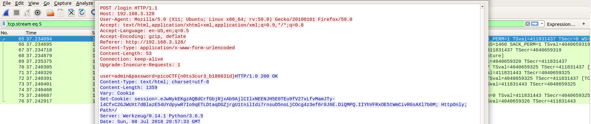

# Problem
We captured some [traffic](https://2018shell1.picoctf.com/static/1a6db339e11fa100ef52d944edaa9612/data.pcap) logging into the admin panel, can you find the password?

## Hints:
Tools like wireshark are pretty good for analyzing pcap files.

## Solution:

First, we download the file
```bash
wget https://2018shell1.picoctf.com/static/1a6db339e11fa100ef52d944edaa9612/data.pcap
```

Open it with wireshark:
```bash
wireshark ./data.pcap
```

Lets follow TCP streams, loot at stream 5:



Fount it!

Flag: picoCTF{n0ts3cur3_b186631d}
