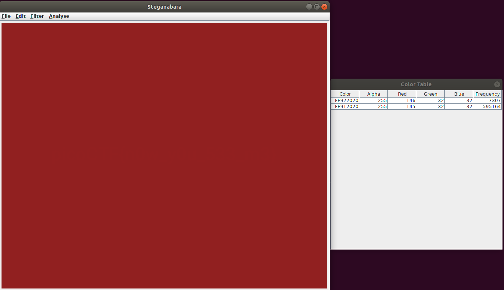
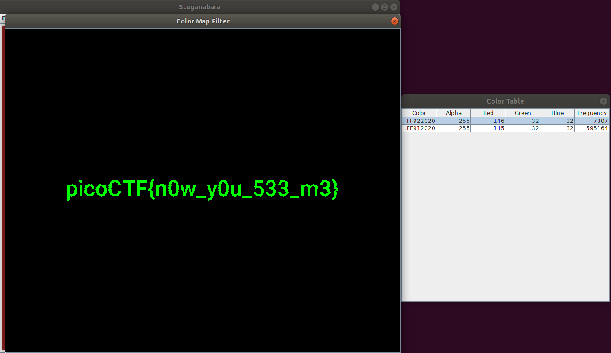

# Problem
We heard that there is something hidden in this [picture](https://2018shell1.picoctf.com/static/e7afc1873bc40e4d15f532b4859623e7/nowYouDont.png). Can you find it?

## Hints:
There is an old saying: if you want to hide the treasure, put it in plain sight. Then no one will see it.

Is it really all one shade of red?

## Solution:

First, we download the image and take a look at it
```bash
wget https://2018shell1.picoctf.com/static/e7afc1873bc40e4d15f532b4859623e7/nowYouDont.png
xdg-open ./nowYouDont.png
```


The hint says that there is more than one shade of red there.

Lets use [steganabara](https://github.com/zardus/ctf-tools/blob/master/steganabara/install)

Look at the color table:



Now we filter color:



Got it.

We can do this as well with a python script:
```python
#!/usr/bin/env python

from PIL import Image
from collections import Counter

im = Image.open('nowYouDont.png')

cnt = Counter(list(im.getdata())).most_common(2)

print cnt

pixelMap = im.load()

img = Image.new(im.mode, im.size)
pixelsNew = img.load()
for i in range(img.size[0]):
    for j in range(img.size[1]):
        if 146 in pixelMap[i,j]:
            pixelMap[i,j] = (0, 0, 0, 255)
        pixelsNew[i,j] = pixelMap[i,j]

im.close()
img.show()
```

Flag: picoCTF{n0w_y0u_533_m3}