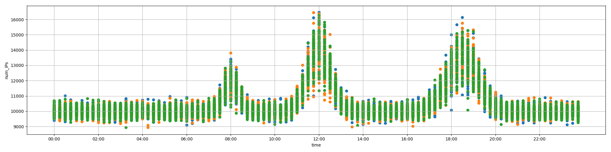

# Problem
Some odd [traffic](https://2018shell1.picoctf.com/static/0fed6840477a6f0d3e4c9636d0e136a5/traffic.png) has been detected on the network, can you identify it? More [info](https://2018shell1.picoctf.com/static/0fed6840477a6f0d3e4c9636d0e136a5/info.txt) here. Connect with ```nc 2018shell1.picoctf.com 3693``` to help us answer some questions.

## Hints:

## Solution:

First, we download the file:
```bash
wget https://2018shell1.picoctf.com/static/0fed6840477a6f0d3e4c9636d0e136a5/traffic.png
wget https://2018shell1.picoctf.com/static/0fed6840477a6f0d3e4c9636d0e136a5/info.txt
cat ./info.txt
xdg-open ./traffic.png

You've been given a dataset of 4800 internet traffic logs for your
organization's website. This dataset covers the number of unique IP addresses
sending requests to the site in 15-minute "buckets", across a 24-hour day.
The attached plot will help you see the daily pattern of traffic. You should
see 3 spikes of traffic: one in the morning, one at midday, and one in the
evening.

Your organization needs your help to figure out whether some recent activity
indicates unusual behavior. It looks like some logs have higher-than-usual
traffic in their time bucket: many more unique IP addresses are trying to
access the site than usual. This might be evidence that someone is trying to
do something shady on your site.
```



Now lets connect:
```bash
nc 2018shell1.picoctf.com 3693

You'll need to consult the file `traffic.png` to answer the following questions.


Which of these logs have significantly higher traffic than is usual for their time of day? You can see usual traffic on the attached plot. There may be multiple logs with higher than usual traffic, so answer all of them! Give your answer as a list of `log_ID` values separated by spaces. For example, if you want to answer that logs 2 and 7 are the ones with higher than usual traffic, type 2 7.
    log_ID      time  num_IPs
0        0  04:30:00    10170
1        1  06:30:00    11593
2        2  09:45:00    10119
3        3  12:30:00    17205
4        4  12:45:00    11557
5        5  14:45:00     9828
6        6  15:30:00     9951
7        7  18:00:00    11921
8        8  19:30:00    14311
9        9  20:30:00     9398
10      10  21:15:00    11618
11      11  21:15:00    10150
12      12  23:45:00    10227
13      13  23:45:00     9364
```

Questions about the graph. We can answer them manually, or write a script:
```python
#!/usr/bin/env python

from pwn import *


traffic = {
	'00:00:00': 10750,
	'00:15:00': 10750,
	'00:30:00': 11000,
	'00:45:00': 10750,

	'01:00:00': 10700,
	'01:15:00': 10750,
	'01:30:00': 10750,
	'01:45:00': 10750,

	'02:00:00': 10750,
	'02:15:00': 10750,
	'02:30:00': 10750,
	'02:45:00': 10750,

	'03:00:00': 10750,
	'03:15:00': 10750,
	'03:30:00': 10750,
	'03:45:00': 10750,

	'04:00:00': 10750,
	'04:15:00': 10750,
	'04:30:00': 10750,
	'04:45:00': 10750,

	'05:00:00': 10750,
	'05:15:00': 11000,
	'05:30:00': 10750,
	'05:45:00': 10750,

	'06:00:00': 11000,
	'06:15:00': 10750,
	'06:30:00': 10750,
	'06:45:00': 10750,

	'07:00:00': 11000,
	'07:15:00': 11000,
	'07:30:00': 11750,
	'07:45:00': 12900,

	'08:00:00': 13900,
	'08:15:00': 12900,
	'08:30:00': 11750,
	'08:45:00': 11100,

	'09:00:00': 10750,
	'09:15:00': 10750,
	'09:30:00': 10750,
	'09:45:00': 10750,

	'10:00:00': 11000,
	'10:15:00': 11000,
	'10:30:00': 11000,
	'10:45:00': 11000,

	'11:00:00': 11750,
	'11:15:00': 13000,
	'11:30:00': 14500,
	'11:45:00': 16500,

	'12:00:00': 16500,
	'12:15:00': 15900,
	'12:30:00': 15000,
	'12:45:00': 12900,

	'13:00:00': 11500,
	'13:15:00': 11400,
	'13:30:00': 11000,
	'13:45:00': 10750,

	'14:00:00': 10800,
	'14:15:00': 10800,
	'14:30:00': 10800,
	'14:45:00': 10800,

	'15:00:00': 10800,
	'15:15:00': 10800,
	'15:30:00': 10800,
	'15:45:00': 10800,

	'16:00:00': 10800,
	'16:15:00': 10800,
	'16:30:00': 11000,
	'16:45:00': 11000,

	'17:00:00': 11500,
	'17:15:00': 12000,
	'17:30:00': 12800,
	'17:45:00': 13800,

	'18:00:00': 15000,
	'18:15:00': 15800,
	'18:30:00': 16150,
	'18:45:00': 15250,

	'19:00:00': 15250,
	'19:15:00': 13500,
	'19:30:00': 12750,
	'19:45:00': 11750,

	'20:00:00': 11250,
	'20:15:00': 11000,
	'20:30:00': 10750,
	'20:45:00': 10750,

	'21:00:00': 10750,
	'21:15:00': 10750,
	'21:30:00': 11000,
	'21:45:00': 11000,

	'22:00:00': 11000,
	'22:15:00': 11000,
	'22:30:00': 10750,
	'22:45:00': 10750,

	'23:00:00': 10750,
	'23:15:00': 10750,
	'23:30:00': 10750,
	'23:45:00': 10750,

}

r = remote('2018shell1.picoctf.com', 3693)

sleep(0.5)
lines = r.recv().split('\n')

s = []
log.info('Setting threshold to 1.02')
log.info('{:<10}{:<10}{:<10}{:<10}'.format('ID', 'Normal', 'Current', 'Analysis'))
for l in lines[5:-1]:
	l = l.split()
	if traffic[l[2]]*1.02 < int(l[3], 10):
		log.info('{:<10}{:<10}{:<10}High!'.format(l[1], traffic[l[2]], int(l[3], 10)))
		s.append(l[1])
	else:
		log.info('{:<10}{:<10}{:<10}Normal'.format(l[1], traffic[l[2]], int(l[3], 10)))

log.info('Sending: {}'.format(' '.join(s)))
r.sendline(' '.join(s))
print r.recvall()
```

Flag: picoCTF{w4y_0ut_d2b8ece5}