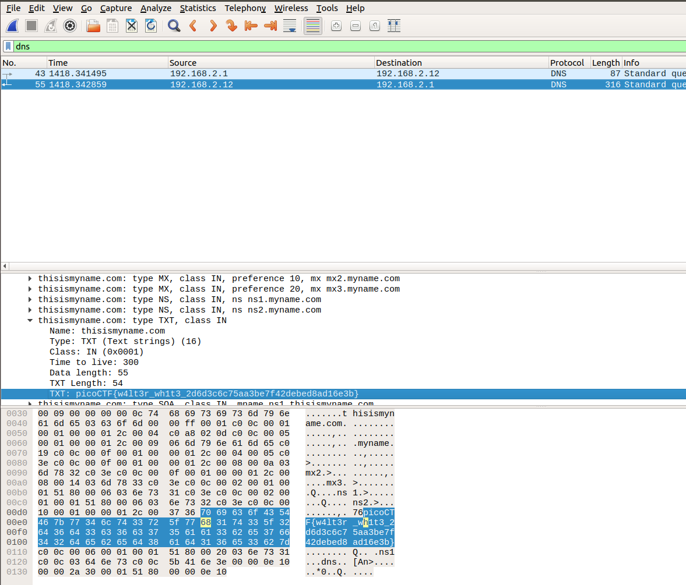

# Problem
Say my name, say [my name](https://2018shell1.picoctf.com/static/e14c089226cbde988ebff69d59780471/myname.pcap).

## Hints:

If you visited a website at an IP address, how does it know the name of the domain?

## Solution:

First, we download the file:
```bash
wget https://2018shell1.picoctf.com/static/e14c089226cbde988ebff69d59780471/myname.pcap
```

The hint suggest that we should look at the [DNS](https://en.wikipedia.org/wiki/Domain_Name_System) packets. Let do this with wireshark.



Flag: picoCTF{w4lt3r_wh1t3_2d6d3c6c75aa3be7f42debed8ad16e3b}