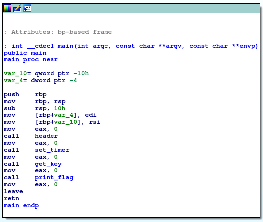
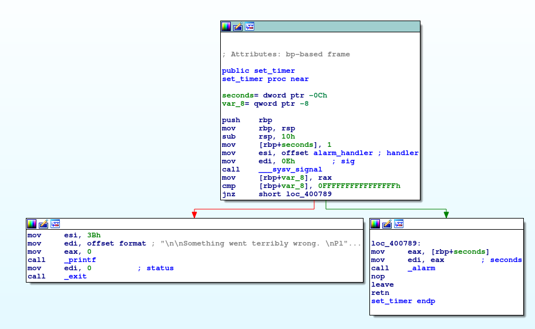
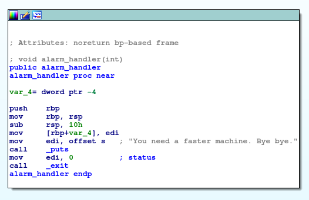

# Problem
You find [this](https://www.youtube.com/watch?v=CTt1vk9nM9c) when searching for some music, which leads you to [be-quick-or-be-dead-1](https://2018shell1.picoctf.com/static/1a796b0425170aa031a6ad476c64bf75/be-quick-or-be-dead-1). Can you run it fast enough? You can also find the executable in /problems/be-quick-or-be-dead-1_1_d0d1dc1d01c7fd569eac77763d813c6f.

## Hints:
What will the key finally be?

## Solution:

First lets download the file and try to execute it
```bash
wget https://2018shell1.picoctf.com/static/1a796b0425170aa031a6ad476c64bf75/be-quick-or-be-dead-1
chmod +x ./be-quick-or-be-dead-1
./be-quick-or-be-dead-1

Be Quick Or Be Dead 1
=====================

Calculating key...
You need a faster machine. Bye bye.
```

Lets try to understand whats going on there, we can use [IDA](https://www.hex-rays.com/products/ida/) for disassembly (or even objdump/gdb)





```set_timer()``` sets 1 sec timer with callback function that exists the program.

After that, ```get_key()``` tried to calcualte the key (```calculate_key()```), which is being passed to ```print_flag()``` which in turn decrypts the flag and prints it.

As we saw earlier, 1 sec isn't enough for that.

We can solve it in many ways.
* We can patch the binary and set a longer timeout
* We can debug the program, skip the call to ```set_timer()``` and hope for a fast solution.

Lets try the second way, pass this gdbinit to gdb (look at [this](https://sourceware.org/gdb/onlinedocs/gdb/Init-File-in-the-Current-Directory.html))
```bash
break *0x0000000000400845
run
set $rip = 0x000000000040084f
continue
```

```bash
gdb -x ./gdbinit ./be-quick-or-be-dead-1

Breakpoint 1, 0x0000000000400845 in main ()
Calculating key...
Done calculating key
Printing flag:
picoCTF{why_bother_doing_unnecessary_computation_fedbb737}
[Inferior 1 (process 7491) exited normally]
```

Claculation takes few seconds...

Flag: picoCTF{why_bother_doing_unnecessary_computation_fedbb737}
