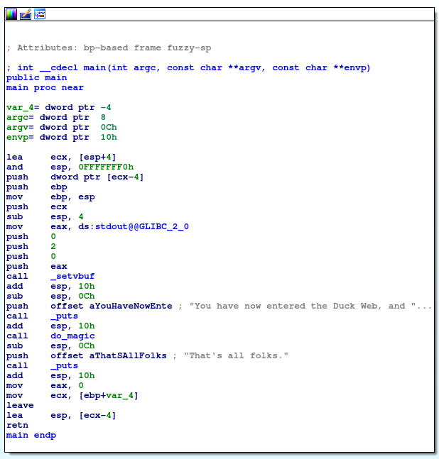
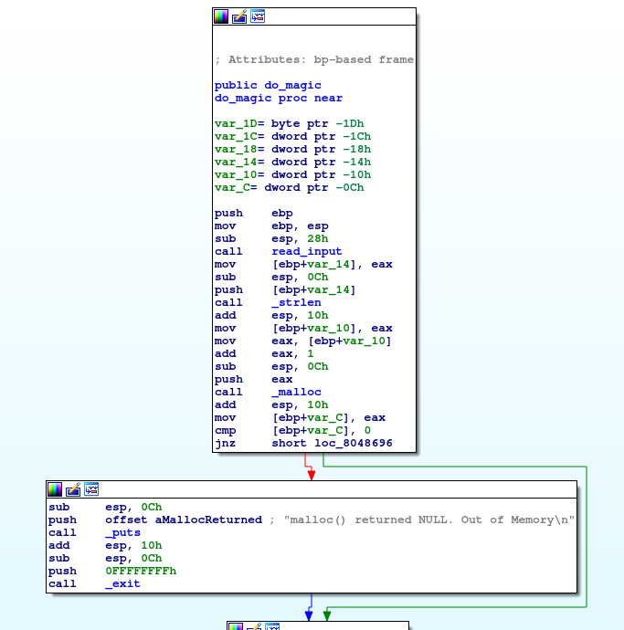
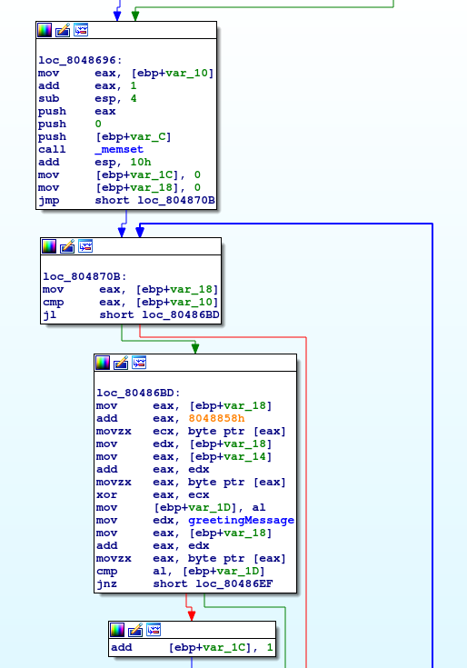
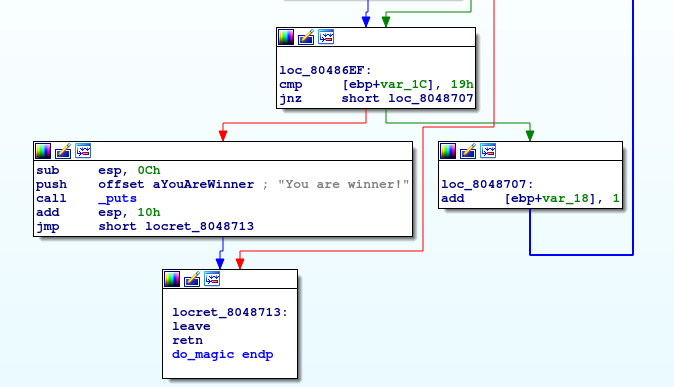

# Problem
Can you deal with the Duck Web? Get us the flag from this [program](https://2018shell1.picoctf.com/static/1d21f78fd2b82ebff2ad54a8b09081c8/main). You can also find the program in /problems/quackme_3_9a15a74731538ce2076cd6590cf9e6ca.

## Hints:
Objdump or something similar is probably a good place to start.

## Solution:
First lets download the file and try to execute it
```bash
wget https://2018shell1.picoctf.com/static/1d21f78fd2b82ebff2ad54a8b09081c8/main
chmod +x ./main
./main

You have now entered the Duck Web, and you're in for a honkin' good time.
Can you figure out my trick?
<INPUT>
That's all folks.
```

Lets try to understand whats going on there, we can use [IDA](https://www.hex-rays.com/products/ida/) for disassembly (or even objdump/gdb)



And ```do_magic()```:





There are few ways to solve this challenge:
* Reversing
* Brute-forcing inputs

### Method 1 - Reversing
```read_input()``` (called from ```do_magic()``` just reads line from the input). The address of the string saved in var_14. The length is being saved to var_10.

A new string of the same size is being allocated (var_C), and being set to zero (using ```memset```).

var_1C and var_18 are set to zero.

Lets call the string at 0x8048858h (0x29, 0x6, 0x16, 0x4F, 0x2B, 0x35, 0x30, 0x1E, 0x51, 0x1B, 0x5B, 0x14, 0x4B, 0x8, 0x5D, 0x2B, 0x52, 0x17, 0x1, 0x57, 0x16, 0x11, 0x5C, 0x7, 0x5D, 0x0) xor_string.

Iterating over the input (with var_18 as the index):
* Set var_1D := xor_string[var_18] ^ var_14[var_18].
* Compare var_1D to greetingMessage[var_18], if equal, increase var_1C (greetingMessage = You have now entered the Duck Web, and you're in for a honkin' goot time. ...)
* if var_1C equals 0x19, we won.

If out input equals to the xor of the greeingMessage with the xor_string, we win.

This simple script can generate the input for us:
```python
#!/usr/bin/env python

def xor_s(s1, s2):
	s = ''

	for a,b in zip(s1, s2):
		s += chr(ord(a) ^ ord(b))

	return s

xor_string = "\x29\x06\x16\x4f\x2b\x35\x30\x1e\x51\x1b\x5b\x14\x4b\x08\x5d\x2b\x52\x17\x01\x57\x16\x11\x5c\x07\x5d\x00"
greetingMessage = "You have now entered the Duck Web" # This is enough for our purpose

print xor_s(xor_string, greetingMessage)
```

Output: ```picoCTF{qu4ckm3_7ed36e4b}```

### Method 2 - Brute-Forcing (like a retard)
We can see that each successful comparison increased var_1C by one. 

This is done in the instruction ```add [ebp+var_1C], 1``` which is at address 0x80486eb in the binary.

We can set a breakpoint there, brute-force one byte, and count hits (each time increase the amount of deired hits).

Using this ugly code:
```python
#!/usr/bin/env python

import gdb
import string


class MyBreakpoint(gdb.Breakpoint):
    def stop (self):
        global count

        count += 1

        return False

gdb.execute('file ./main')

# Suppress output
gdb.execute('set logging file /dev/null')
gdb.execute('set logging redirect on')
gdb.execute('set logging off')
gdb.execute('set print inferior-events off')

bp = MyBreakpoint("*0x80486eB")

count = 0
flag = 'pico'

while flag[-1] != '}':
	for c in string.ascii_lowercase + string.ascii_uppercase + string.digits + '!@#$%^&*(){}_':
		count = 0

		gdb.execute('run < <(echo "{}") > /dev/null'.format(flag + c), to_string=True)
		if count > len(flag):
			flag = flag + c

			print ('Partial flag: {}'.format(flag))

			break

gdb.execute('quit')
print ('Flag: {}'.format(flag))
```

**Note: I'm sure there is a proper way doing this with pwntools, pls tell me if you know how**

### Method 3 - Brute-Forcing (like a boss)
Working with [angr](https://github.com/angr).

#### Installation
```bash
sudo apt-get install python3-dev libffi-dev build-essential virtualenvwrapper
pip install angr
```
#### Solution
**TODO**

Flag: picoCTF{qu4ckm3_7ed36e4b}
