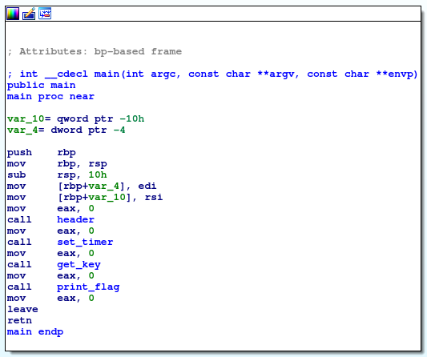
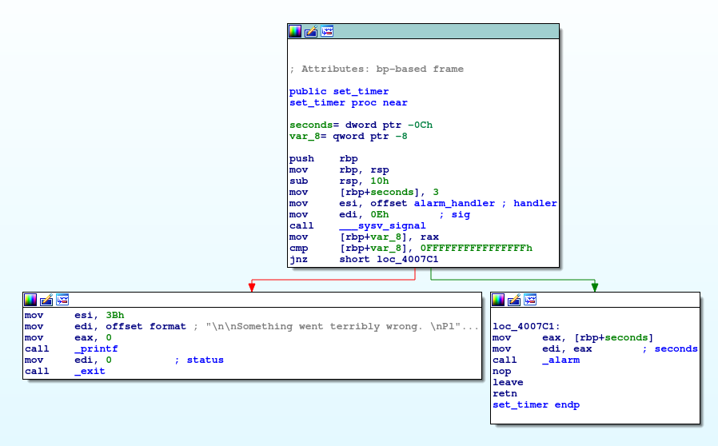
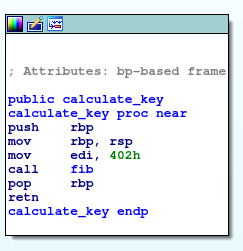

# Problem
As you enjoy this [music](https://www.youtube.com/watch?v=CTt1vk9nM9c) even more, another executable [be-quick-or-be-dead-2](https://2018shell1.picoctf.com/static/fecde258147ce824e3e7524e79c1100d/be-quick-or-be-dead-2) shows up. Can you run this fast enough too? You can also find the executable in /problems/be-quick-or-be-dead-2_2_7e92e9cc48bad623da1c215c192bc919.

## Hints:
Can you call stuff without executing the entire program?

What will the key finally be?

## Solution:

First lets download the file and try to execute it
```bash
wget https://2018shell1.picoctf.com/static/fecde258147ce824e3e7524e79c1100d/be-quick-or-be-dead-2
chmod +x ./be-quick-or-be-dead-2
./be-quick-or-be-dead-2

Be Quick Or Be Dead 2
=====================

Calculating key...
You need a faster machine. Bye bye.
```

Again, too slow. Lets try to understand whats going on there, we can use [IDA](https://www.hex-rays.com/products/ida/) for disassembly (or even objdump/gdb)




We can try the same approach from [be_quick_or_be_dead_1](../be_quick_or_be_dead_1-200/solution.md), but it takes to long...

Lets take a look at the ```calculate_key()``` function:




It just calculates [Fib 0x402](http://www.wolframalpha.com/input/?i=fib+0x402+mod+2%5E32) in a recursive manner, thats why it takes too long... (ofc only last 32bits of it will be returned).

Lets do this again with gdb...

This time, we will just set ```$eax``` to "Fibonacci 0x402" (0xf70a9b58)

Use this gdbinit script:
```bash
break *0x00000000004007e1
run
set $rip = 0x00000000004007e6
set $eax = 0xf70a9b58
continue
quit
```

```bash
gdb -x ./gdbinit ./be-quick-or-be-dead-2

Breakpoint 1, 0x00000000004007e1 in get_key ()
Done calculating key
Printing flag:
picoCTF{the_fibonacci_sequence_can_be_done_fast_7e188834}
[Inferior 1 (process 9169) exited normally]
```

Instantly solves it.

Flag: picoCTF{the_fibonacci_sequence_can_be_done_fast_7e188834}
