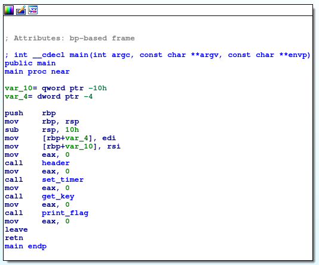
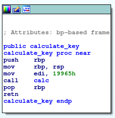
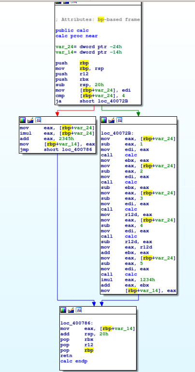

# Problem
As the [song](https://www.youtube.com/watch?v=CTt1vk9nM9c) draws closer to the end, another executable [be-quick-or-be-dead-3](https://2018shell1.picoctf.com/static/f717342fdea2596b569b162e648679c4/be-quick-or-be-dead-3) suddenly pops up. This one requires even faster machines. Can you run it fast enough too? You can also find the executable in /problems/be-quick-or-be-dead-3_2_fc35b1f6832df902b8e2f724772d012f.

## Hints:
How do you speed up a very repetitive computation?

## Solution:

First lets download the file and try to execute it
```bash
wget https://2018shell1.picoctf.com/static/f717342fdea2596b569b162e648679c4/be-quick-or-be-dead-3
chmod +x ./be-quick-or-be-dead-3
./be-quick-or-be-dead-3

Be Quick Or Be Dead 3
=====================

Calculating key...
You need a faster machine. Bye bye.
```

Way too slow. Lets try to understand whats going on there, we can use [IDA](https://www.hex-rays.com/products/ida/) for disassembly (or even objdump/gdb)




We can try the same approach from [be_quick_or_be_dead_2](../be_quick_or_be_dead_2-275/solution.md), we just need to reverse the  ```calculate_key()``` function, and precompute the key:



We can use this script:
```python
#!/usr/bin/env python

# eq = f(x) = (f(x-1) - f(x-2) + f(x-3) - f(x-4) + f(x-5)*1234h)
# we need f(19965h)

f = []#[0, 1, 2, 3, 4]
for x in range(5):
	f.append(x * x + 0x2345)

for x in range(5, 0x19965 + 1):
	f.append( f[x-1] - f[x-2] + f[x-3] - f[x-4] + 0x1234*f[x-5])

print f[-1] % 2**32
```

The key is: ```2653079950```

Use this gdbinit to gdb (look at [this](https://sourceware.org/gdb/onlinedocs/gdb/Init-File-in-the-Current-Directory.html))
```bash
break *0x0000000000400828
run
set $rip = 0x000000000040082d
set $eax = 2653079950
continue
quit
```

```bash
gdb -x ./gdbinit ./be-quick-or-be-dead-3

Breakpoint 1, 0x0000000000400828 in get_key ()
Done calculating key
Printing flag:
picoCTF{dynamic_pr0gramming_ftw_b5c45645}
[Inferior 1 (process 9918) exited normally]
```

Done in a blink of an eye!

Flag: picoCTF{dynamic_pr0gramming_ftw_b5c45645}
