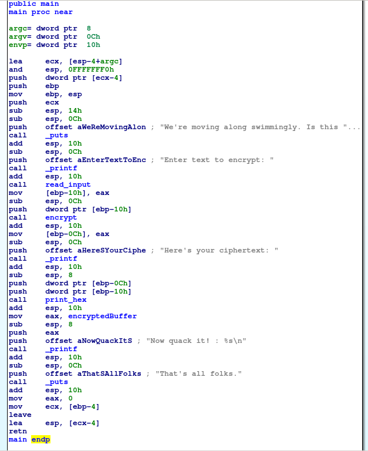
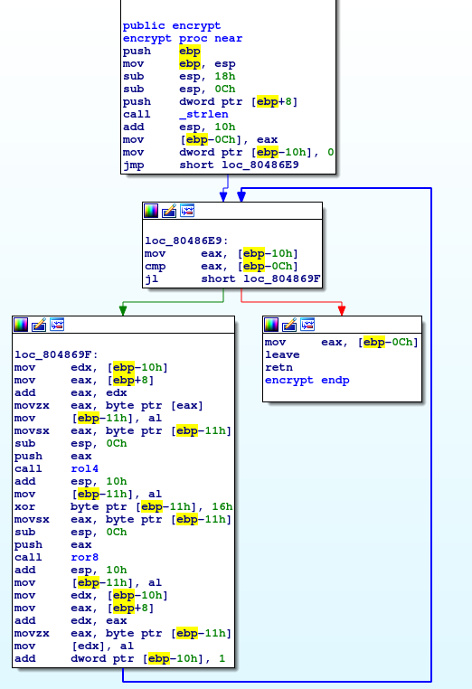
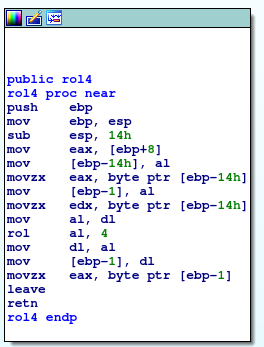

# Problem
The duck puns continue. Can you crack, I mean quack this [program](https://2018shell1.picoctf.com/static/6e068b4a5cd05bd84fac735d4223a916/main) as well? You can find the program in /problems/quackme-up_4_5cc9019c8499d6d124cd8e8109a0f95b on the shell server.

## Hints:

## Solution:
First lets download the file and try to execute it
```bash
wget https://2018shell1.picoctf.com/static/6e068b4a5cd05bd84fac735d4223a916/main
chmod +x ./main
./main

We're moving along swimmingly. Is this one too fowl for you?
Enter text to encrypt: a <INPUT>
Here's your ciphertext: 00 <OUTPUT>
Now quack it! : 11 80 20 E0 22 53 72 A1 01 41 55 20 A0 C0 25 E3 35 40 55 30 85 55 70 20 C1
That's all folks.
```

Lets take a look with IDA (although we dont really need to):



And ```encrypt()```:



```rol4()```:



```ror8()```:


There are few ways to solve this challenge:
* Reversing
* Just thinking

### Method 1 - Reversing
Lets focus on ```encrypt()```.

* [ebp+8]   - Input string
* [ebp-10h] - Index
* [ebp-0Ch] - Length of input string

Iterating over the input:
* Loading current char to eax
* Call ```rol4()``` - which actually switchs the nibbles.
* Xor the output with 0x16.
* Call ```ror8()``` - which do nothing.

The inverse is:
* Xor cipher with 0x16.
* Switch nibbles.

Lets code:
```python
#!/usr/bin/env python

def decrypt(c):
	c = int(c, 16) ^ 0x16

	cl = c % 2**4
	ch = c >> 4

	c = ch + (cl << 4)

	return chr(c)

cipher = '11 80 20 E0 22 53 72 A1 01 41 55 20 A0 C0 25 E3 35 40 55 30 85 55 70 20 C1'

plain = map(decrypt, cipher.split())

print ''.join(plain)
```

Output: ```picoCTF{qu4ckm3_2e4b94fc}```

### Method 2 - Using our brain
It looks like a mono-alphabetic cipher. We can just encrypt the alphabet and create our own dictionary.

Then we use it to decrypt the flag.

```python
#!/usr/bin/env python

from pwn import *
import string


p = process('./main')

print p.recv()

alphabet = string.ascii_lowercase + string.digits + string.punctuation + string.ascii_uppercase

p.sendline(alphabet)

lines = p.recvall().split('\n')

m = lines[0].split(':')[2].strip()
q = lines[1].split(':')[1].strip()

mm = { }
for a, c in zip(alphabet, m.split()):
	mm[c] = a

log.info('Map: {}'.format(m))
log.info('Need to decrypt: {}'.format(q))

s = ''
for c in q.split():
	s += mm[c]

print s
```

Flag: picoCTF{qu4ckm3_2e4b94fc}
