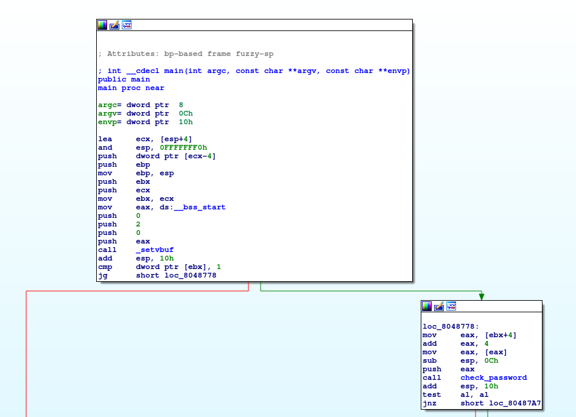
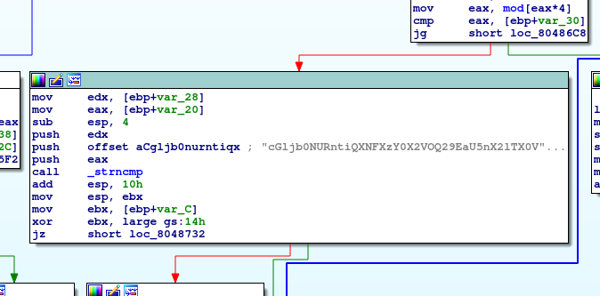

# Problem
Can you find the password to [Radix's login](https://2018shell1.picoctf.com/static/2f848bb17aae35fb0fc703cbe15afbef/radix)? You can also find the executable in /problems/radix-s-terminal_1_35b3f86ea999e44d72e988ef4035e872?

## Hints:
https://en.wikipedia.org/wiki/Base64

## Solution:

First lets download the file and try to execute it
```bash
wget https://2018shell1.picoctf.com/static/2f848bb17aae35fb0fc703cbe15afbef/radix
chmod +x ./radix
./radix

Please provide a password!

./radix 1

Incorrect Password!
```

Lets look with IDA:



We can try to reverse the function, but there is a shortcut, there is a string there (strings could find it as well):



```cGljb0NURntiQXNFXzY0X2VOQ29EaU5nX2lTX0VBc1lfMTg3NTk3NDV9```

Lets use the hint and try to decode it from base64.

```bash
echo "cGljb0NURntiQXNFXzY0X2VOQ29EaU5nX2lTX0VBc1lfMTg3NTk3NDV9" | base64 -d

picoCTF{bAsE_64_eNCoDiNg_iS_EAsY_18759745}
```

Just to make sure:
```bash
./radix picoCTF{bAsE_64_eNCoDiNg_iS_EAsY_18759745}

Congrats, now where's my flag?
```

Got lucky...

Flag: picoCTF{bAsE_64_eNCoDiNg_iS_EAsY_18759745}
