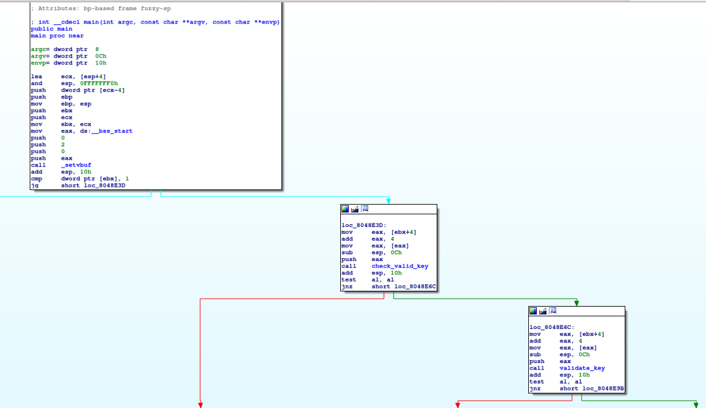
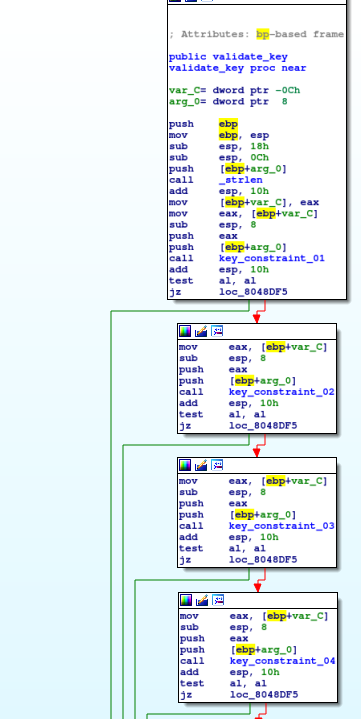

# Problem
The software has been updated. Can you find us a new product key for the [program](https://2018shell1.picoctf.com/static/2c81d98c822d4a4bf6cd163a42768a0e/activate) in /problems/keygen-me-2_1_762036cde49fef79146a706d0eda80a3

## Hints:
z3

## Solution:

Lets download the file and try to execute it:
```bash
wget https://2018shell1.picoctf.com/static/2c81d98c822d4a4bf6cd163a42768a0e/activate
chmod +x ./activate
./activate

Usage: ./activate <PRODUCT_KEY>

./activate a

Please Provide a VALID 16 byte Product Key.
```

We need to find a valid key!
Lets ovserve with IDA:



We need to pass two checks: ```check_valid_key```, ```validate_key```.

We already know ```check_valid_key``` (from [keygen_me_1](https://github.com/sefi-roee/CTFs-Writeups/blob/master/picoCTF-2018/Reversing/13-keygen_me_1-400/solution.md)):



Now we have few constraints, after reversing them I got the following code:
```python
#!/usr/bin/env python

from pwn import *
from constraint import *

user = ''
pw = ''

debug = 0

problem = Problem()
for i in range(16):
	problem.addVariable('k{}'.format(i), range(10 + 26))

problem.addConstraint(lambda a, b: (a + b) % 36 == 14, 			('k0', 'k1')) 			# constraint_01
problem.addConstraint(lambda a, b: (a + b) % 36 == 24, 			('k2', 'k3')) 			# constraint_02
problem.addConstraint(lambda a, b: (b - a + 36) % 36 == 6, 		('k0', 'k2')) 			# constraint_03
problem.addConstraint(lambda a, b, c: (a + b + c) % 36 == 4, 	('k1', 'k3', 'k5')) 	# constraint_04
problem.addConstraint(lambda a, b, c: (a + b + c) % 36 == 13, 	('k2', 'k4', 'k6')) 	# constraint_05
problem.addConstraint(lambda a, b, c: (a + b + c) % 36 == 22, 	('k3', 'k4', 'k5')) 	# constraint_06
problem.addConstraint(lambda a, b, c: (a + b + c) % 36 == 31, 	('k6', 'k8', 'k10')) 	# constraint_07
problem.addConstraint(lambda a, b, c: (a + b + c) % 36 == 7, 	('k1', 'k4', 'k7')) 	# constraint_08
problem.addConstraint(lambda a, b, c: (a + b + c) % 36 == 20, 	('k9', 'k12', 'k15')) 	# constraint_09
problem.addConstraint(lambda a, b, c: (a + b + c) % 36 == 12, 	('k13', 'k14', 'k15')) 	# constraint_10
problem.addConstraint(lambda a, b, c: (a + b + c) % 36 == 27, 	('k8', 'k9', 'k10')) 	# constraint_11
problem.addConstraint(lambda a, b, c: (a + b + c) % 36 == 23, 	('k7', 'k12', 'k13')) 	# constraint_12

sol = problem.getSolution()

key = ''

for i in range(16):
	if sol['k{}'.format(i)] < 10:
		key += str(sol['k{}'.format(i)])
	else:
		key += chr(sol['k{}'.format(i)] - 10 + ord('A'))

log.info('Found key: {}'.format(key))

if debug:
	p = process('./activate {}'.format(key), shell=True)
else:
	s = ssh(host = '2018shell1.picoctf.com', user=user, password=pw)
	s.set_working_directory('/problems/keygen-me-2_1_762036cde49fef79146a706d0eda80a3')

	p = s.process('./activate {}'.format(key), shell=True)

print p.recvall()```

The output:
```bash
[*] Found key: FZL3H2BRL7ZZZX1E
[+] Connecting to 2018shell1.picoctf.com on port 22: Done
[!] Couldn't check security settings on '2018shell1.picoctf.com'
[*] Working directory: '/problems/keygen-me-2_1_762036cde49fef79146a706d0eda80a3'
[+] Starting remote process '/bin/sh' on 2018shell1.picoctf.com: pid 809401
[+] Receiving all data: Done (85B)
[*] Stopped remote process 'sh' on 2018shell1.picoctf.com (pid 809401)
Product Activated Successfully: picoCTF{c0n5tr41nt_50lv1nG_15_W4y_f45t3r_3846045707}
```

Flag: picoCTF{c0n5tr41nt_50lv1nG_15_W4y_f45t3r_3846045707}
