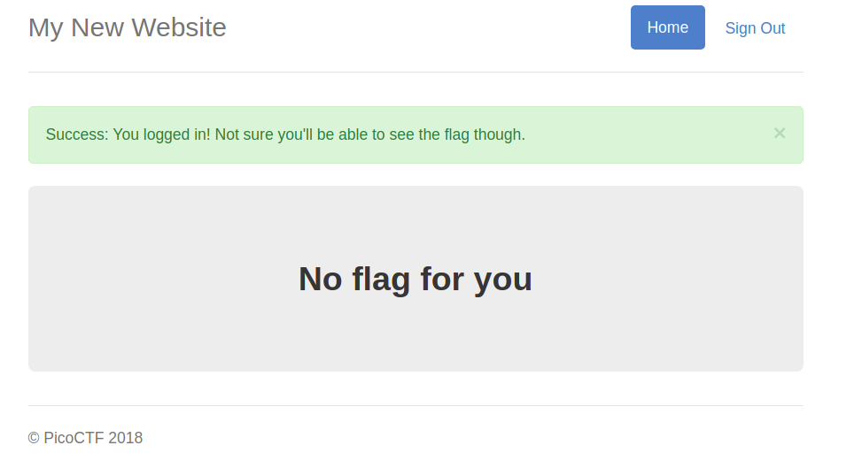
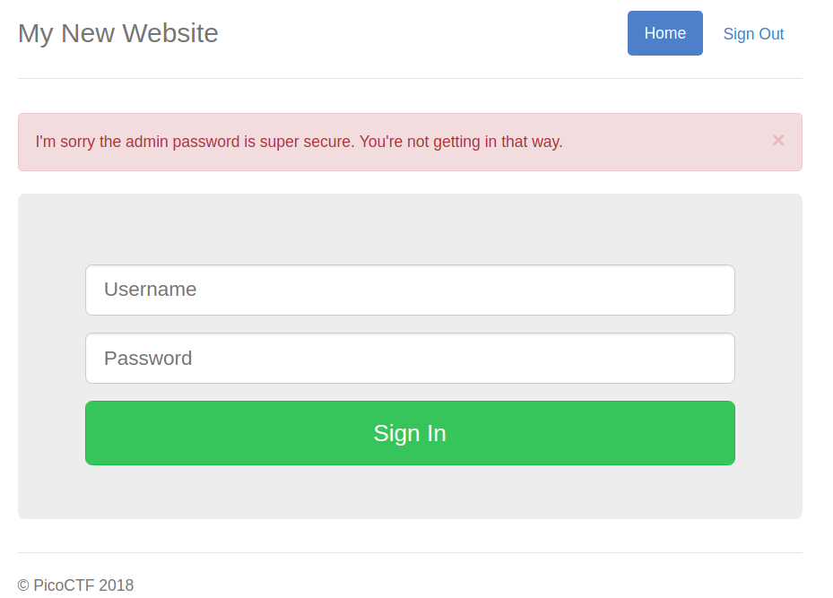
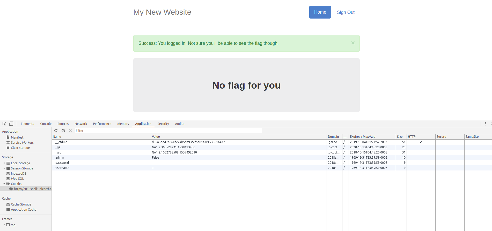
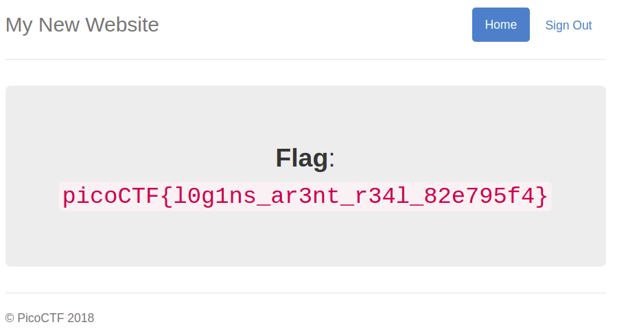

# Problem
I made a website so now you can log on to! I don't seem to have the admin password. See if you can't get to the flag. [http://2018shell1.picoctf.com:6153](http://2018shell1.picoctf.com:6153/)

## Hints:
Hmm it doesn't seem to check anyone's password, except for admins?

How does check the admin's password?

## Solution:

Lets fuzz with the website a little.
login as 1/1



No flag, damn!

Lets try to login ad admin



We dont know the password.

Lets login again as 1/1 and check for cookie:



We can just change ```admin``` cookie to ```True``` (using chrome developer tools) and reload the page.



Flag: picoCTF{l0g1ns_ar3nt_r34l_82e795f4}
