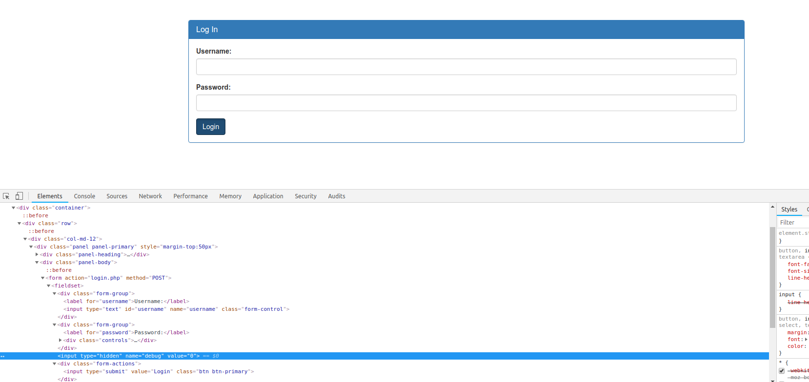
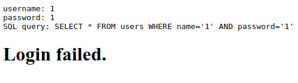
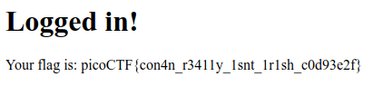

# Problem
There is a website running at [http://2018shell1.picoctf.com:52012](http://2018shell1.picoctf.com:52012). Do you think you can log us in? Try to see if you can login!

## Hints:
There doesn't seem to be many ways to interact with this, I wonder if the users are kept in a database?

## Solution:

We open the website, and we can see many pictures.


Lets try the "admin login" (from the sidebar panel), and view source



We can see hidden input with value "0" for debug. Lets change it to 1, and try to login:



This is probably vulnerable to SQL injection.

Lets try to login with:
* Username:	admin' -- 
* Password: <EMPTY>

The query will be
```SQL
SELECT * FROM users WHERE name='admin' -- AND password=''
```

Nice, got the flag!



Flag: picoCTF{con4n_r3411y_1snt_1r1sh_c0d93e2f}
