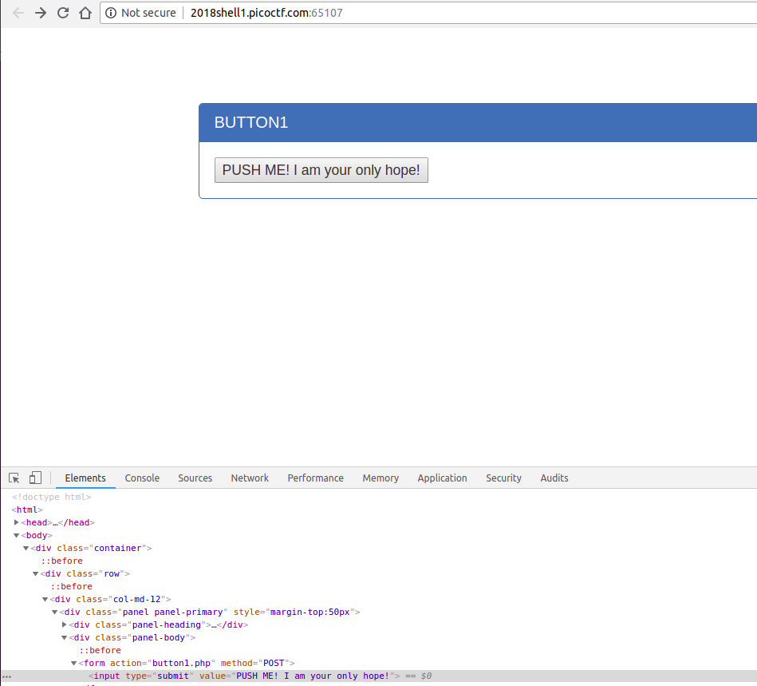
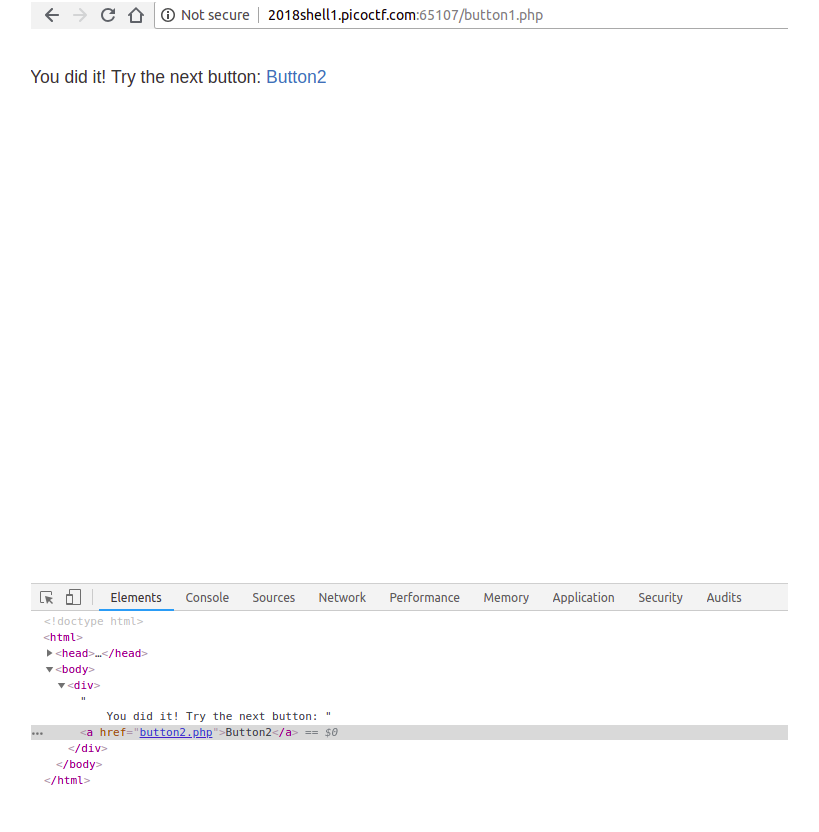

# Problem
There is a website running at [http://2018shell1.picoctf.com:65107](http://2018shell1.picoctf.com:65107). Try to see if you can push their buttons.

## Hints:
What's different about the two buttons?

## Solution:

Lets try to view the website:




Lets try create a [POST](https://en.wikipedia.org/wiki/POST_(HTTP)) request to button2.php. We can use [curl](https://curl.haxx.se/).

```bash
curl -X POST http://2018shell1.picoctf.com:65107/button2.php

Well done, your flag is: picoCTF{button_button_whose_got_the_button_91f6f39a}
```

OWNed it!

Flag: picoCTF{button_button_whose_got_the_button_91f6f39a}
