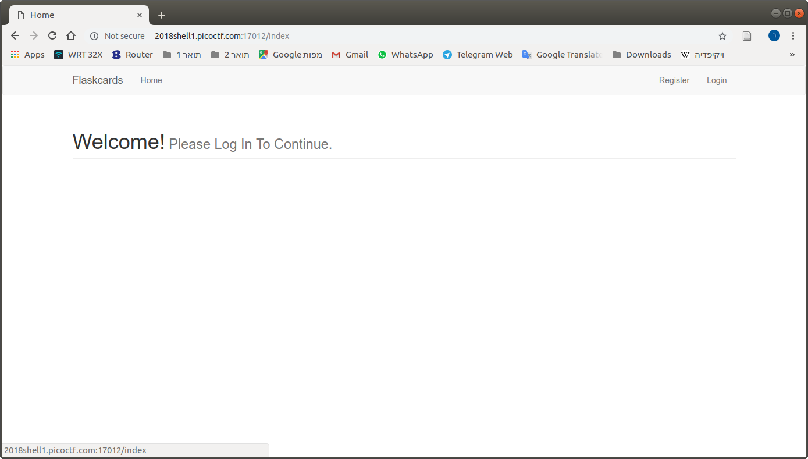
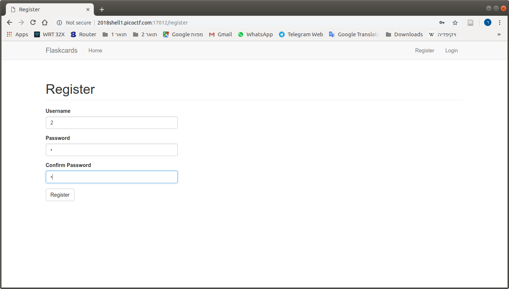
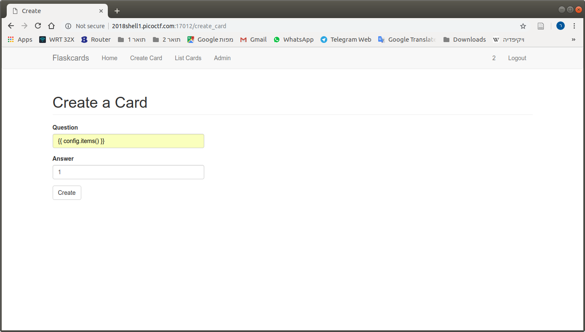
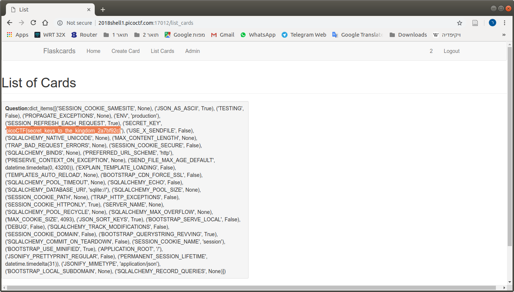

# Problem
We found this fishy [website](http://2018shell1.picoctf.com:17012/) for flashcards that we think may be sending secrets. Could you take a look?

## Hints:
Are there any common vulnerabilities with the backend of the website?

Is there anywhere that filtering doesn't get applied?

The database gets reverted every 2 hours so your session might end unexpectedly. Just make another user

## Solution:
This site is written in [flask](http://flask.pocoo.org/).

Searching for common vulnerabilites (as the hint suggests), we get [flask injections](https://nvisium.com/blog/2015/12/07/injecting-flask.html)

Lets do this.

Flag: picoCTF{secret_keys_to_the_kingdom_2a7bf92c}
