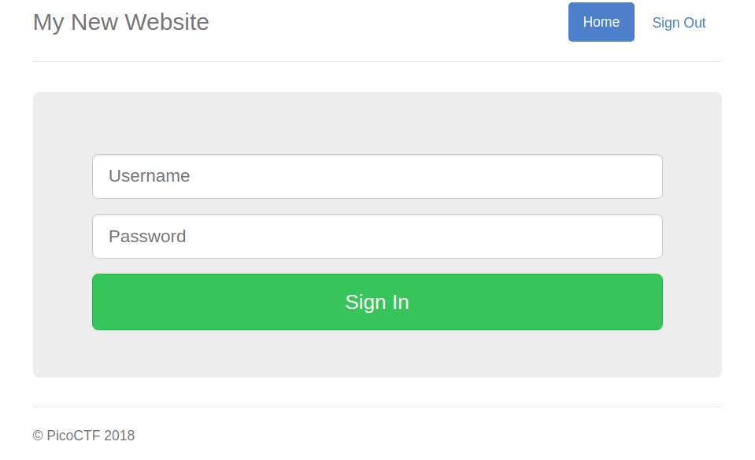
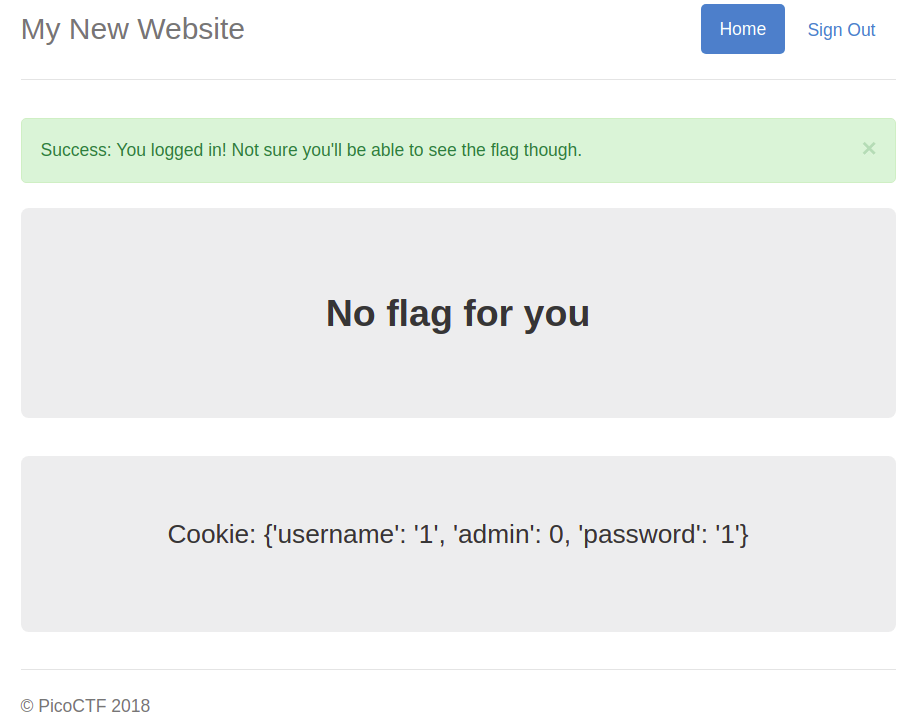

# Problem
Uh oh, the login page is more secure... I think. [http://2018shell1.picoctf.com:43731](http://2018shell1.picoctf.com:43731). Source.

## Hints:
There are versions of AES that really aren't secure.

## Solution:
Lets take a loot at website:



```html

<!DOCTYPE html>
<html lang="en">

<head>
    <title>My New Secure Website</title>


    <link href="http://maxcdn.bootstrapcdn.com/bootstrap/3.2.0/css/bootstrap.min.css" rel="stylesheet">

    <link href="https://getbootstrap.com/docs/3.3/examples/jumbotron-narrow/jumbotron-narrow.css" rel="stylesheet">

    <script src="https://ajax.googleapis.com/ajax/libs/jquery/3.3.1/jquery.min.js"></script>

    <script src="https://maxcdn.bootstrapcdn.com/bootstrap/3.3.7/js/bootstrap.min.js"></script>


</head>

<body>

    <div class="container">
        <div class="header">
            <nav>
                <ul class="nav nav-pills pull-right">
                    <li role="presentation" class="active"><a href="/">Home</a>
                    </li>
                    <li role="presentation"><a href="/logout" class="btn btn-link pull-right">Sign Out</a>
                    </li>
                </ul>
            </nav>
            <h3 class="text-muted">My New Website</h3>
        </div>
        
        <!-- Categories: success (green), info (blue), warning (yellow), danger (red) -->
        
      
      <div class="jumbotron">
        <p class="lead"></p>
        <div class="login-form">
            <form role="form" action="/login" method="post">
                <div class="form-group">
                    <input type="text" name="user" id="email" class="form-control input-lg" placeholder="Username">
                </div>
                <div class="form-group">
                    <input type="password" name="password" id="password" class="form-control input-lg" placeholder="Password">
                </div>
            </div>
            <div class="row">
                <div class="col-xs-12 col-sm-12 col-md-12">
                    <input type="submit" class="btn btn-lg btn-success btn-block" value="Sign In">
                </div>
            </div>
        </form>
    </div>
    <footer class="footer">
        <p>&copy; PicoCTF 2018</p>
    </footer>

</div>

<script>
$(document).ready(function(){
    $(".close").click(function(){
        $("myAlert").alert("close");
    });
});
</script>
</body>

</html>
```

The source doesn't help much.
Lets try to login with 1/1:



Lets take a look at the cookie:


Lets try a simple [CCA](https://en.wikipedia.org/wiki/Chosen-ciphertext_attack) attack:
```python
#!/usr/bin/env python

from pwn import *
import requests
import base64


def xor_s(s1, s2):
	s = ''

	for a,b in zip(s1, s2):
		s += chr(ord(a) ^ ord(b))

	return s

url = 'http://2018shell1.picoctf.com:43731/'
params = {'user': '0', 'password': '0'}
headers = {
	'User-Agent': 'Mozilla/5.0 (X11; Linux x86_64) AppleWebKit/537.36 (KHTML, like Gecko) Chrome/68.0.3440.106 Safari/537.36'
	}

s = requests.Session()

log.info('Make POST request')
r = s.post('{}/login'.format(url), data=params, headers=headers)

r.cookies = s.cookies

log.info('Original cookie (base64): {}'.format(r.cookies['cookie']))

cookie_e = base64.b64decode(r.cookies['cookie'])
cookie_p = "{'admin': 0, 'password': '0', 'username': '0'}"

p1 = "{'admin': 0, 'pa"
p1_crafted = "{'admin': 1, 'pa"

iv = cookie_e[:16]

iv = xor_s(xor_s(iv, p1), p1_crafted)

cookie_crafted = iv + cookie_e[16:]
log.info('Crafted cookie: {}'.format(cookie_crafted))
log.info('Crafted cookie (base64):  {}'.format(base64.b64encode(cookie_crafted)))

log.info('Sending crafted request')
r = requests.get('{}/flag'.format(url), cookies = {'cookie': base64.b64encode(cookie_crafted)})

response = r.text.split('\n')

for l in response:
	if 'picoCTF' in l:
		print l

		break
```

```
[*] Make POST request
[*] Original cookie (base64): u8DAdilecp3jsRxU62362J1orxllNbE5PODiLmC3Pg6Rg1BuImIfDMoxgHJYvX+5DH7Q6c50lRsKUR4xdZxKVA==
[*] Crafted cookie: \xbb��v)^r\x9d��T�m�؝h\xaf\x19e5\xb19<��.`\xb7>\x0e\x91\x83Pn"b\x1f\x0c�1\x80rX\xbd\x7f\xb9\x0c~���t\x95\x1b
    Q\x1e1u\x9cJT
[*] Crafted cookie (base64):  u8DAdilecp3jsR1U62362J1orxllNbE5PODiLmC3Pg6Rg1BuImIfDMoxgHJYvX+5DH7Q6c50lRsKUR4xdZxKVA==
[*] Sending crafted request
            <p style="text-align:center; font-size:30px;"><b>Flag</b>: <code>picoCTF{fl1p_4ll_th3_bit3_fa8dae76}</code></p>
```

Done!

Flag: picoCTF{fl1p_4ll_th3_bit3_fa8dae76}
