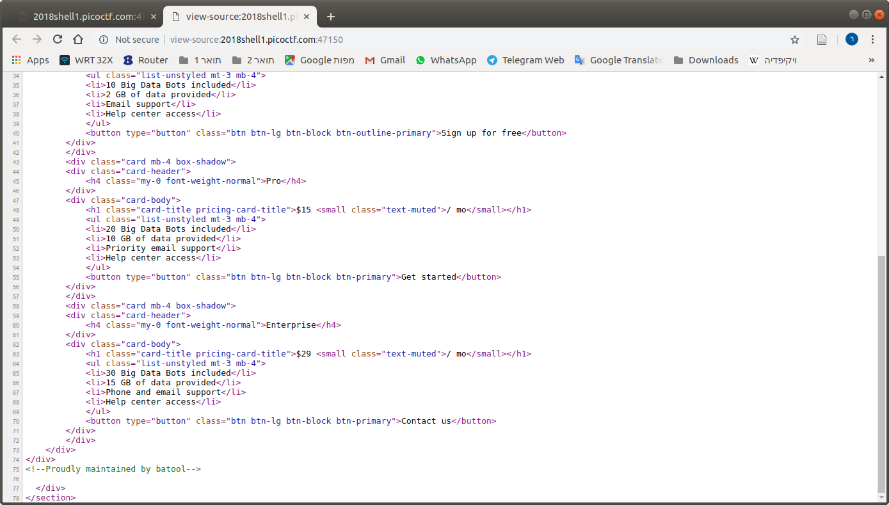
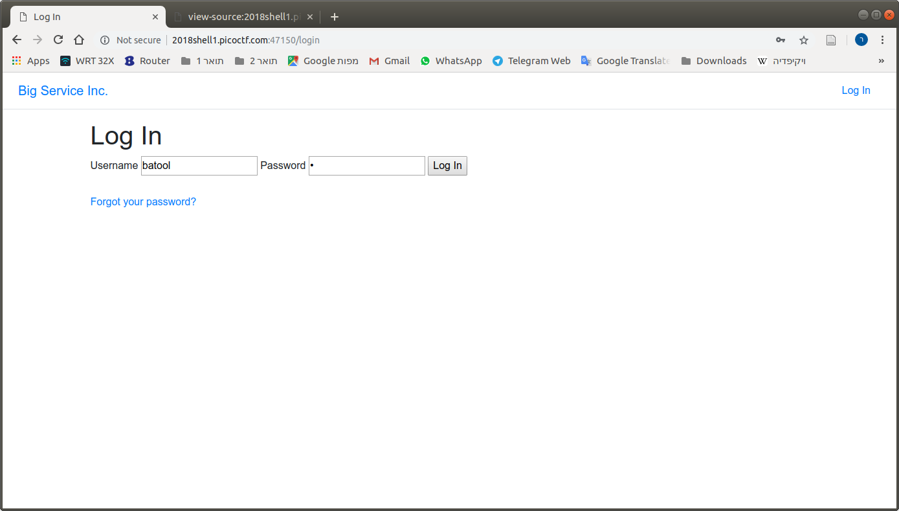
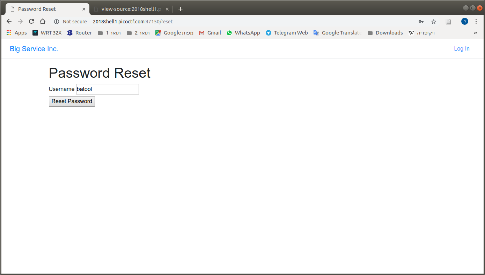
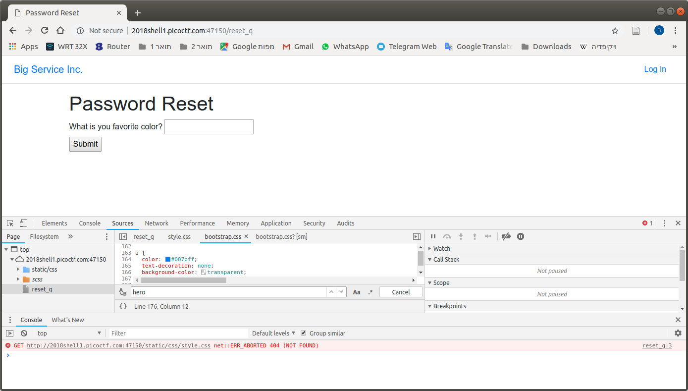
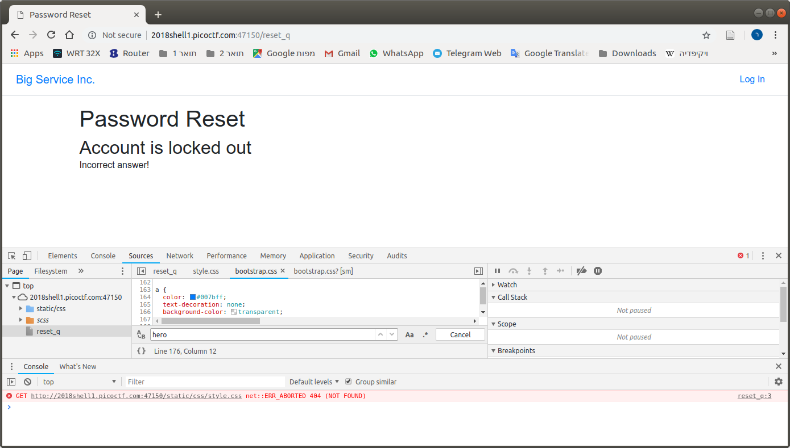
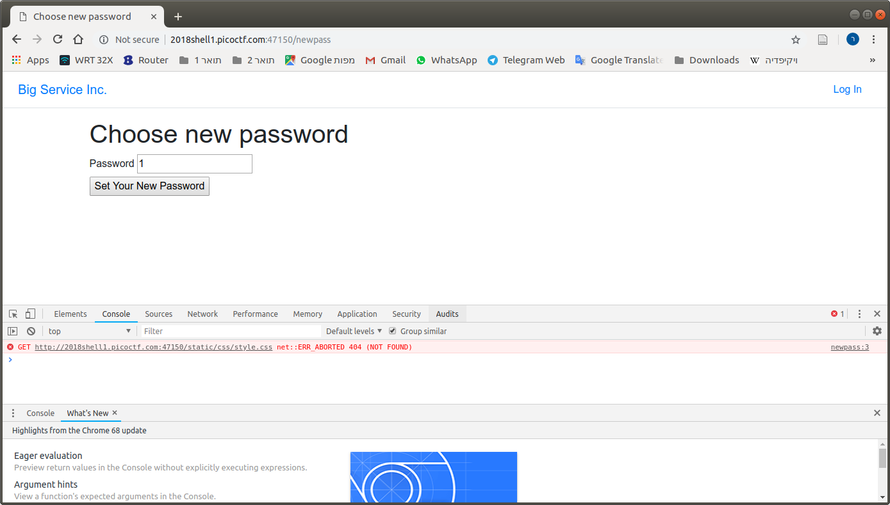
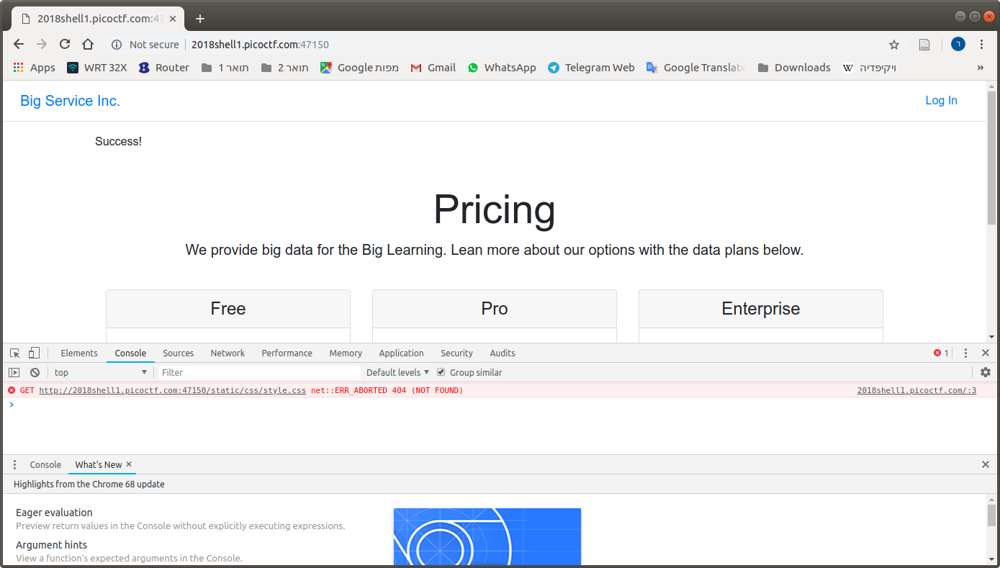
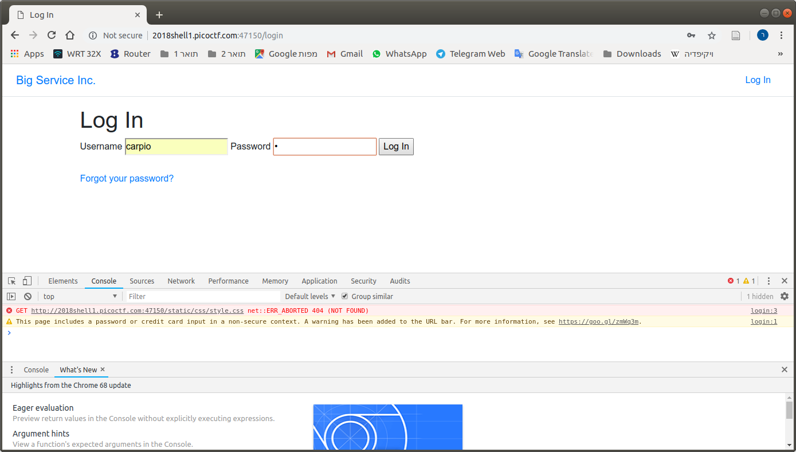
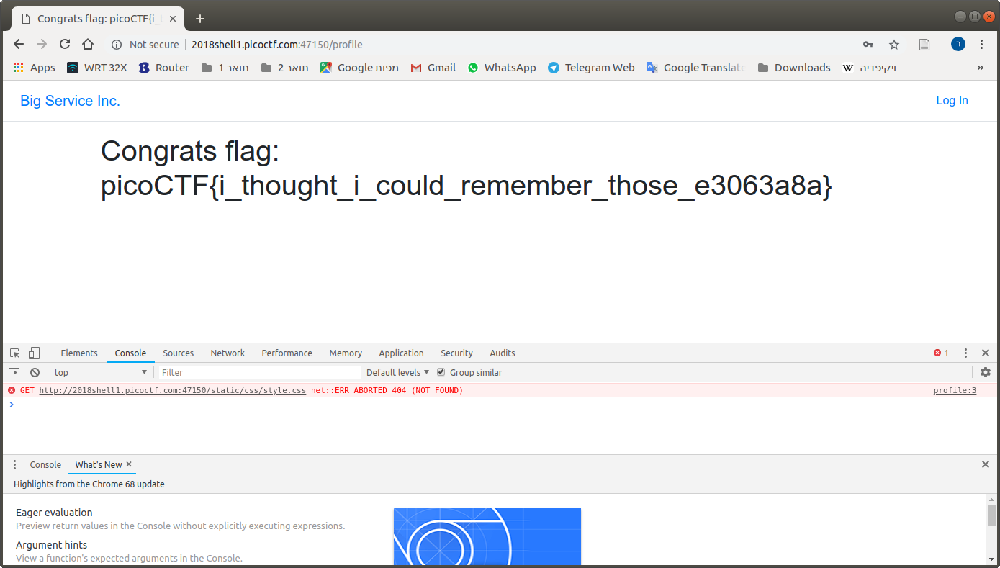

# Problem
There is a website running at [http://2018shell1.picoctf.com:47150](http://2018shell1.picoctf.com:47150). We need to get into any user for a flag!

## Hints:
Try looking past the typical vulnerabilities. Think about possible programming mistakes.

## Solution:
Lets take a look:


And the source:



Lets try to login as ```batool```:




Lets try "password reset":




After refreshing few times, we got this question, Lets try ```black```:



Too many wrong, lets try another user:


Nice, you I got this right. Refresh the page until same question back again, answer correctly 3 times and we can reset password:






**Note: I'm sure there is a way to solve this without guessing, no idea**

Flag: picoCTF{i_thought_i_could_remember_those_e3063a8a}
