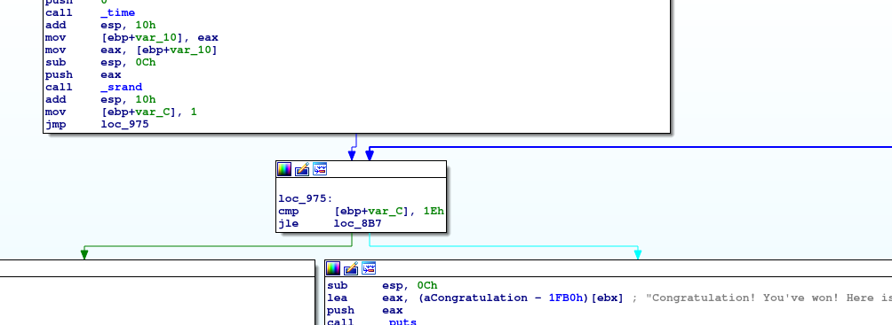
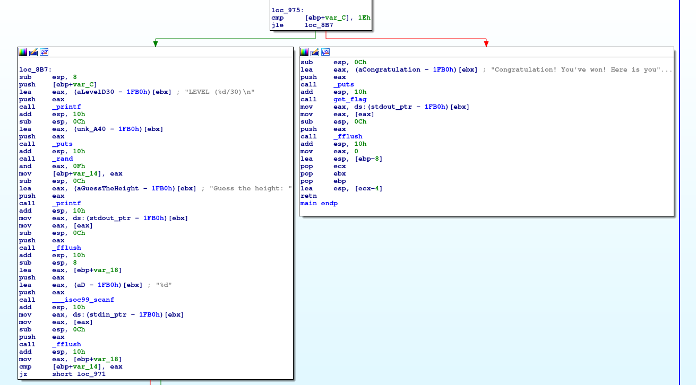
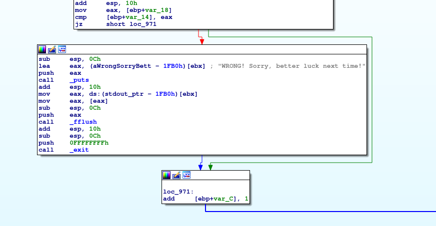

# Problem
The most revolutionary game is finally available: seed sPRiNG is open right now! [seed_spring](https://2019shell1.picoctf.com/static/748e022bb316cfefbeaf513a8618eb77/seed_spring). Connect to it with nc 2019shell1.picoctf.com 45107.

## Hints:

How is that program deciding what the height is?

You and the program should sync up!

## Solution:

Lets download the file:
```bash
wget https://2019shell1.picoctf.com/static/748e022bb316cfefbeaf513a8618eb77/seed_spring
```

Let's execute it:
```bash
nc 2019shell1.picoctf.com 45107


                                                                             
                          #                mmmmm  mmmmm    "    mm   m   mmm 
  mmm    mmm    mmm    mmm#          mmm   #   "# #   "# mmm    #"m  # m"   "
 #   "  #"  #  #"  #  #" "#         #   "  #mmm#" #mmmm"   #    # #m # #   mm
  """m  #""""  #""""  #   #          """m  #      #   "m   #    #  # # #    #
 "mmm"  "#mm"  "#mm"  "#m##         "mmm"  #      #    " mm#mm  #   ##  "mmm"
                                                                             


Welcome! The game is easy: you jump on a sPRiNG.
How high will you fly?

LEVEL (1/30)

Guess the height: 
```

We need to "guess" numbers.

Let's take a look with IDA, after all the printing we have:




There is an initialization of the PRNG (with the current time) followed by 30 levels. If we pass them all, we get the flag.
In each level, a random value is masked with `0xF` and we need to "guess" it.

The ```srand``` call gets an epoch time. We can execute a C code that generates the same series (PRNG.c):
```c
#include <stdio.h>
#include <stdlib.h>
#include <time.h>

int main(int argc, char *argv[]) {
    if (argc != 2)
        return -1;

    time_t t = atol(argv[1]);

    srand(t);

    for (int i = 0; i < 30; i++)
        printf("%d\t", rand() & 0xF);
    printf("\n");

    return 0;
}
```

And now we compile it:
```bash
gcc PRNG.c -o PRNG
```

Finally, we write a python script:
```python
#!/usr/bin/env python
from pwn import *
import subprocess


user = 'RoeeSefi'
pw = 'UTTE9CQN2idX28W'

s = ssh(host = '2019shell1.picoctf.com', user=user, password=pw)
p = s.run('date +%s')

t = p.recvall()

prng = subprocess.Popen(['./PRNG', t], stdout=subprocess.PIPE)
prng_values = prng.stdout.read().split('\t')

log.info('Calculate PRNG values: {}'.format(' '.join(prng_values)))

r = remote('2019shell1.picoctf.com', 45107)

for i in range(30):
    lines = r.recvuntil('Guess the height: ')
    print lines

    log.info('Send: {}'.format(prng_values[i]))
    r.sendline('{}'.format(prng_values[i]))

print r.recvall()
```

Flag: picoCTF{pseudo_random_number_generator_not_so_random_829c50d19ba2bdb441975c0dabfcc1c0}