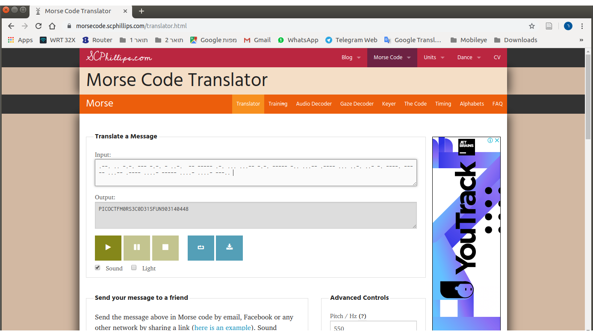

# Problem
Theres tapping coming in from the wires. What's it saying nc 2019shell1.picoctf.com 49914.

## Hints:
What kind of encoding uses dashes and dots?

The flag is in the format PICOCTF{}

## Solution:

Let's connect:
```bash
nc 2019shell1.picoctf.com 49914

.--. .. -.-. --- -.-. - ..-. { -- ----- .-. ... ...-- -.-. ----- -.. ...-- .---- ... ..-. ..- -. ----. ----- ...-- .---- ....- ----- ....- ....- ---.. }
```

It's probably a [Morse Code](https://en.wikipedia.org/wiki/Morse_code)

Let's use an online decoder (https://morsecode.scphillips.com/translator.html), we get:



Flag: PICOCTF{M0RS3C0D31SFUN903140448}
