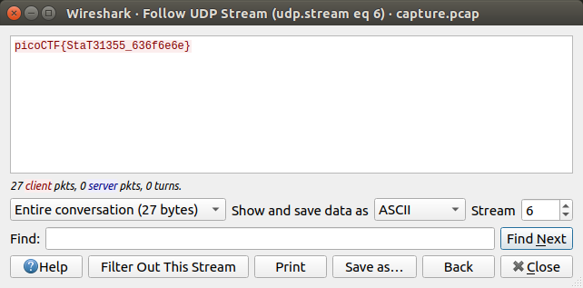

# Problem
We found this [packet capture](https://2019shell1.picoctf.com/static/ae9ca8cff43ed638ed5d137f9ece7455/capture.pcap). Recover the flag. You can also find the file in /problems/shark-on-wire-1_0_13d709ec13952807e477ba1b5404e620.

## Hints:
Try using a tool like Wireshark

What are streams?

## Solution:

First, let's download the file:
```bash
wget https://2019shell1.picoctf.com/static/ae9ca8cff43ed638ed5d137f9ece7455/capture.pcap
```

Let's read all streams and look for the flag:


Found it on stream 6!

Flag: picoCTF{StaT31355_636f6e6e}
