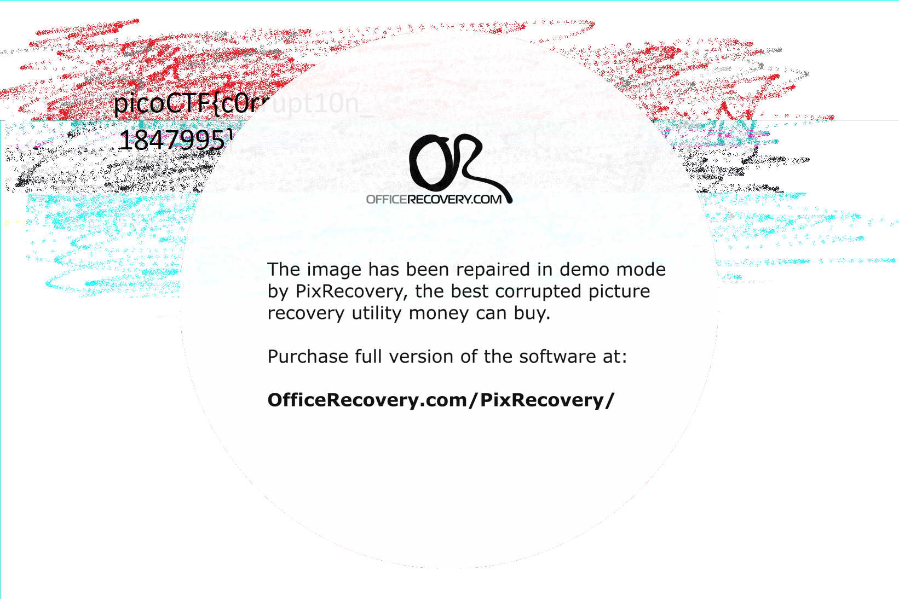

# Problem
We found this [file](https://2019shell1.picoctf.com/static/3435d990f1d20fe3563cbb897b4c96db/mystery). Recover the flag. You can also find the file in /problems/c0rrupt_0_1fcad1344c25a122a00721e4af86de13.

## Hints:

Try fixing the file header

## Solution:

First, let's download the file:
```bash
wget https://2019shell1.picoctf.com/static/3435d990f1d20fe3563cbb897b4c96db/mystery
```

This file is corrupted.

I started to write some [png_parser](../../../tools/png_parser.py). *The tool is not complete yet*

Even after applying all my fixes, the file stay corrupted. But this time, I can use this [office recovery tool](https://online.officerecovery.com/pixrecovery/) and fix it.
We get:


Flag: picoCTF{c0rrupt10n_1847995}
    