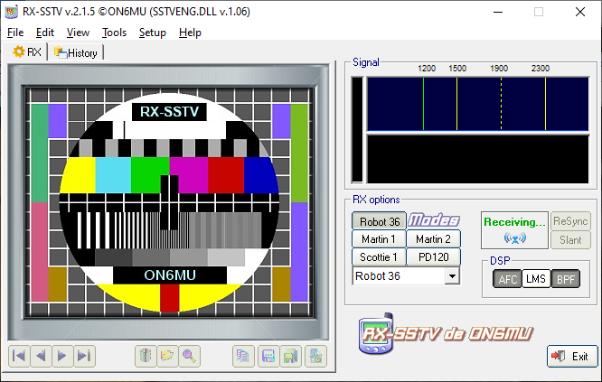
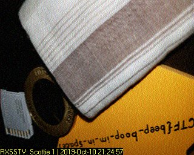

# Problem
Decode this [message](https://2019shell1.picoctf.com/static/6effddc9e024cc28a533b736e46f6d03/message.wav) from the moon. You can also find the file in /problems/m00nwalk_2_ddfd37932ded29f58963e8d9c526c2fa.

## Hints:

How did pictures from the moon landing get sent back to Earth?

What is the CMU mascot?, that might help select a RX option

## Solution:

First, let's download the file:
```bash
wget https://2019shell1.picoctf.com/static/6effddc9e024cc28a533b736e46f6d03/message.wav
```

Some weird wave file.

Some googling led me to [Slow-Scan Television](https://en.wikipedia.org/wiki/Slow-scan_television).
~~Some more googling led me to [qsstv](http://users.telenet.be/on4qz/qsstv/manual/index.html). *I'm having problems with this tool*~~
Some more googling led me to [RX-SSTV](http://users.belgacom.net/hamradio/rxsstv.htm). *Windows tool, at least it works*

The last hint was CMU mascot (which his name is Scottie, which is also one [mode of transmission](https://en.wikipedia.org/wiki/Slow-scan_television#Modulation)).


And after decoding the wave, we get:


Flag: picoCTF{beep_boop_im_in_space}
