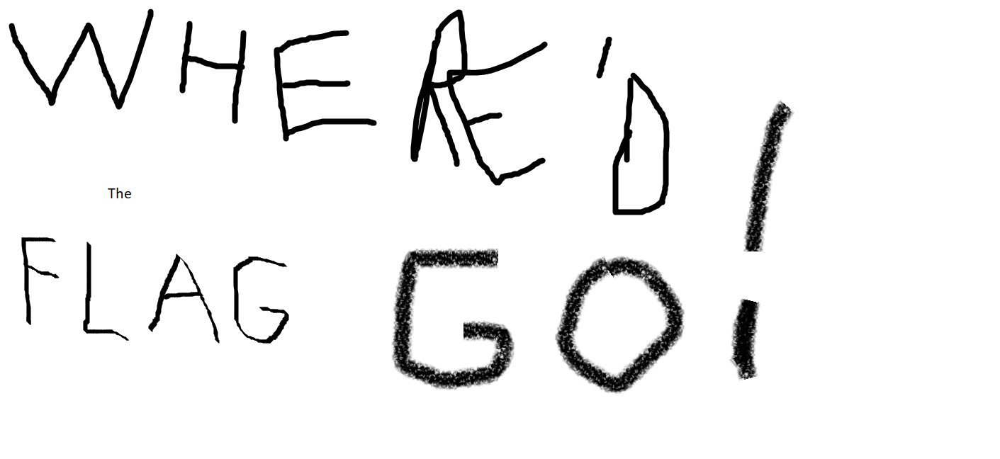
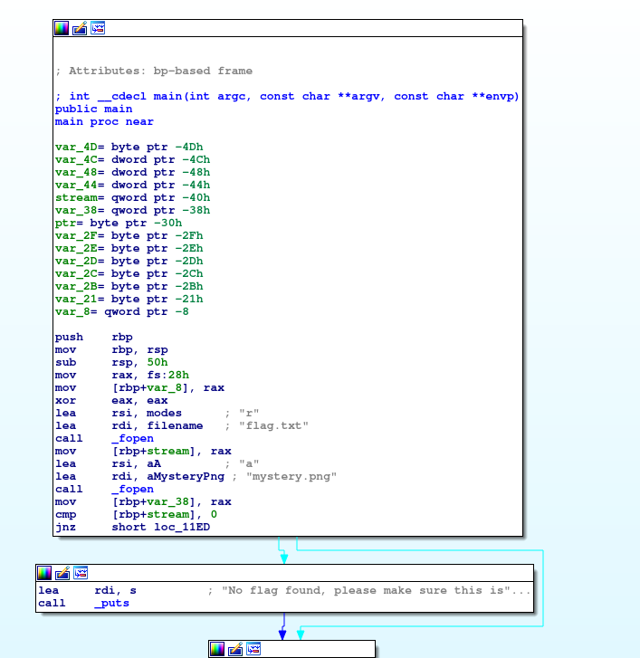
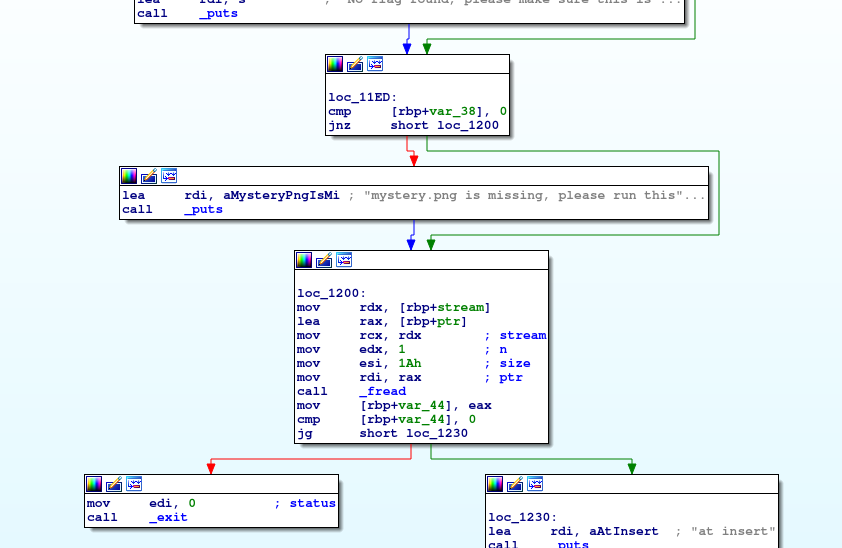
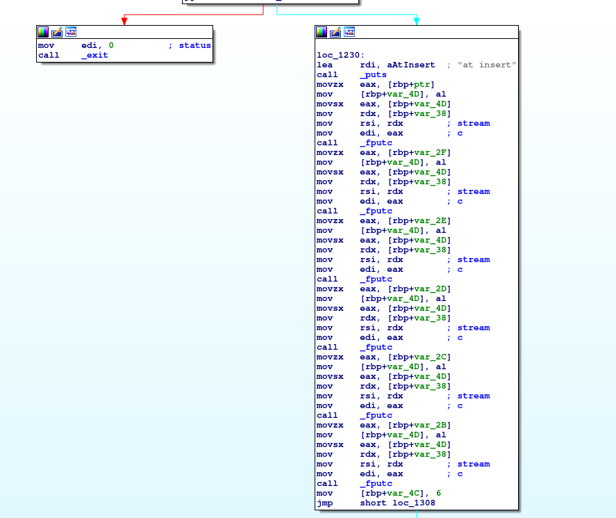
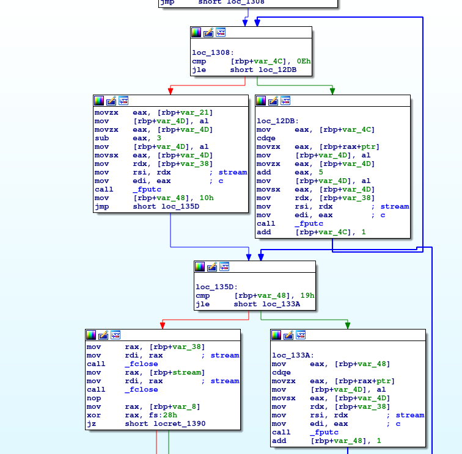
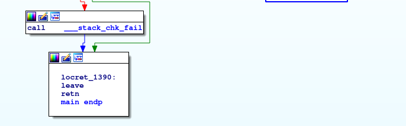

# Problem
We have recovered a [binary](https://2019shell1.picoctf.com/static/ae3e9fb0aa6dd438251939839a7a6f21/mystery) and an [image](https://2019shell1.picoctf.com/static/ae3e9fb0aa6dd438251939839a7a6f21/mystery.png). See what you can make of it. There should be a flag somewhere. Its also found in /problems/investigative-reversing-0_3_80d67b9266f6640e5e3b7e5caefd782c on the shell server.

## Hints:

Try using some forensics skills on the image

This problem requires both forensics and reversing skills

A hex editor may be helpful

## Solution:

First, let's download the files:
```bash
wget https://2019shell1.picoctf.com/static/ae3e9fb0aa6dd438251939839a7a6f21/mystery
wget https://2019shell1.picoctf.com/static/ae3e9fb0aa6dd438251939839a7a6f21/mystery.png
```

We have some binary, and this image:



Trying disassemble the binary with IDA:







As we can see, the flag is encrypted and embbeded to the image (we can also see that using ```xxd```):
```bash
xxd mystery.png

0001e850: 8220 0882 2008 8220 6417 ffef fffd 7f5e  . .. .. d......^
0001e860: ed5a 9d38 d01f 5600 0000 0049 454e 44ae  .Z.8..V....IEND.
0001e870: 4260 8270 6963 6f43 544b 806b 357a 7369  B`.picoCTK.k5zsi
0001e880: 6436 715f 3537 6430 6434 3763 7d         d6q_57d0d47c}
```

As we can see at ```loc_1230```, first 6 bytes are copyied as is.
Now, in ```loc_1308``` and ```loc_12DB``` next ```0xe - 6 = 8``` bytes are being added to `5` and copyied.
The 16th byte is subtracted by `3`.
Finally, last 10 bytes are copyied as is.

Let's extract the encoded_flag:
```bash
dd skip=$(python -c "print 0x0001e870 + 3") count=26 if=mystery.png of=encoded_flag.txt bs=1
xxd encoded_flag.txt 

00000000: 7069 636f 4354 4b80 6b35 7a73 6964 3671  picoCTK.k5zsid6q
00000010: 5f35 3764 3064 3437 637d                 _57d0d47c}
```

Now, with a simple script:
```python
#!/usr/bin/env python

f = open('./encoded_flag.txt', 'r').read()

s = f[:6]

for i in range(6, 15):
    s += chr(ord(f[i]) - 5)

s += chr(ord(f[15]) + 3)

s += f[16:]

print s
```

Nice!

Flag: picoCTF{f0und_1t_57d0d47c}
