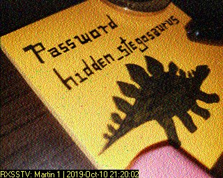
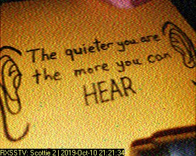
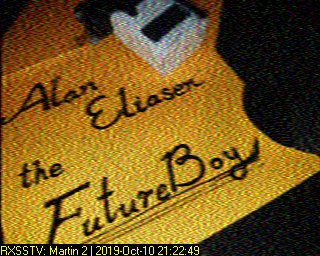

# Problem
Revisit the last transmission. We think this [transmission](https://2019shell1.picoctf.com/static/c7e988106c3ee63b68f181cc5098915e/message.wav) contains a hidden message. There are also some clues [clue 1](https://2019shell1.picoctf.com/static/c7e988106c3ee63b68f181cc5098915e/clue1.wav), [clue 2](https://2019shell1.picoctf.com/static/c7e988106c3ee63b68f181cc5098915e/clue2.wav), [clue 3](https://2019shell1.picoctf.com/static/c7e988106c3ee63b68f181cc5098915e/clue3.wav). You can also find the files in /problems/m00nwalk2_4_db2f361610e04b41a70a92cd8b7b2533.

## Hints:

Use the clues to extract the another flag from the .wav file

## Solution:

First, let's download the files:
```bash
wget https://2019shell1.picoctf.com/static/6effddc9e024cc28a533b736e46f6d03/message.wav
wget https://2019shell1.picoctf.com/static/c7e988106c3ee63b68f181cc5098915e/clue1.wav
wget https://2019shell1.picoctf.com/static/c7e988106c3ee63b68f181cc5098915e/clue2.wav
wget https://2019shell1.picoctf.com/static/c7e988106c3ee63b68f181cc5098915e/clue3.wav
```

We got the same wave, and another 3 clues.

Decoding the clues with the same tool ([look here](../10-m00nwalk-250/solution.md)):





Googling about ```Alan Eliasen``` gave me [this site](https://futureboy.us/stegano/decinput.html).
Decoding the ```message``` with password ```hidden_stegosaurus``` give us the flag.

*We can also use ```steghide```:*
```bash
steghide extract -sf ./message.wav 

Enter passphrase: 
wrote extracted data to "steganopayload12154.txt".
cat steganopayload12154.txt

picoCTF{the_answer_lies_hidden_in_plain_sight}
```

Flag: picoCTF{the_answer_lies_hidden_in_plain_sight}
