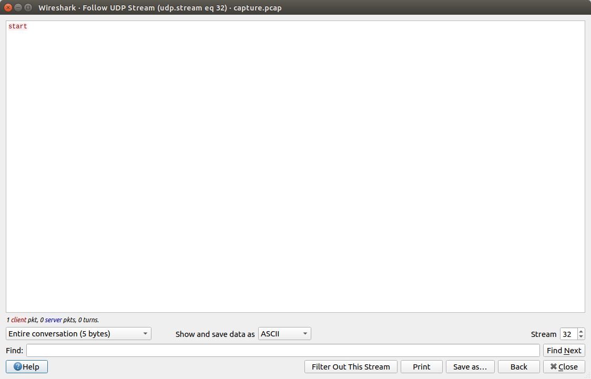
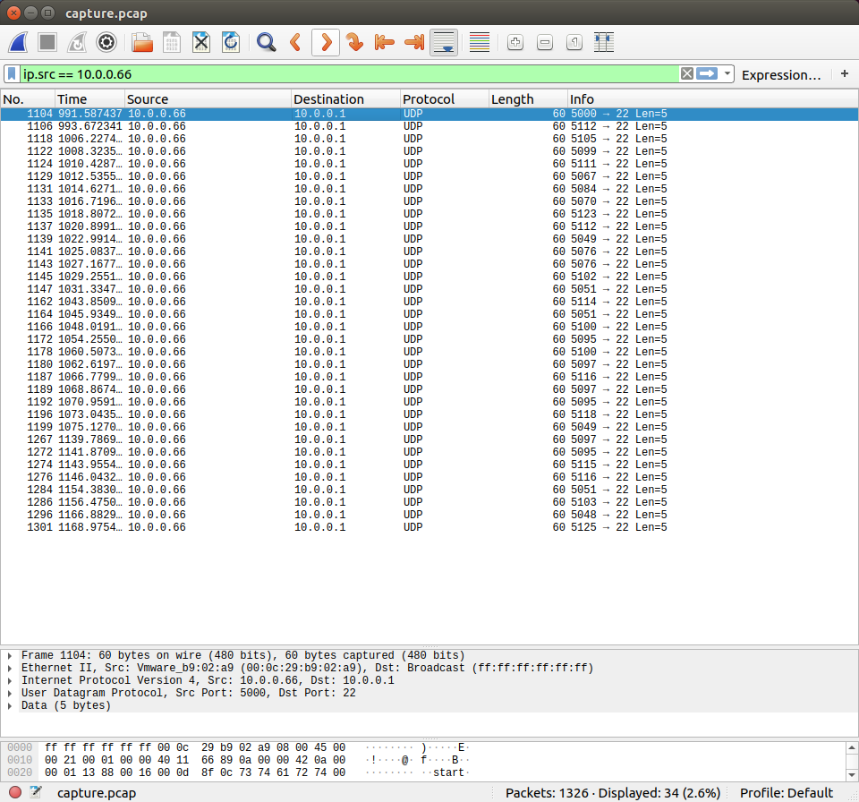

# Problem
We found this [packet capture](https://2019shell1.picoctf.com/static/dcd259894e0efe9d6e91da2af47e6369/capture.pcap). Recover the flag that was pilfered from the network. You can also find the file in /problems/shark-on-wire-2_0_3e92bfbdb2f6d0e25b8d019453fdbf07.

## Hints:

## Solution:

First, let's download the file:
```bash
wget https://2019shell1.picoctf.com/static/dcd259894e0efe9d6e91da2af47e6369/capture.pcap
```

After observing the streams, we found the payload `start` at UDP stream 32.



Filtering source IP, we can see similar packets. The only thing changing is the port number.



Subtracting `5000` from port numbers reveals the flag!

Let's write a simple script:
```bash
#!/bin/bash

chr() {
  printf \\$(printf '%03o' $1)
}

for p in $(tshark -r ./capture.pcap -T fields -e udp.srcport -Y "ip.src == 10.0.0.66"); do
    chr $(( ${p} - 5000 ))
done; echo
```

Flag: picoCTF{p1LLf3r3d_data_v1a_st3g0}
