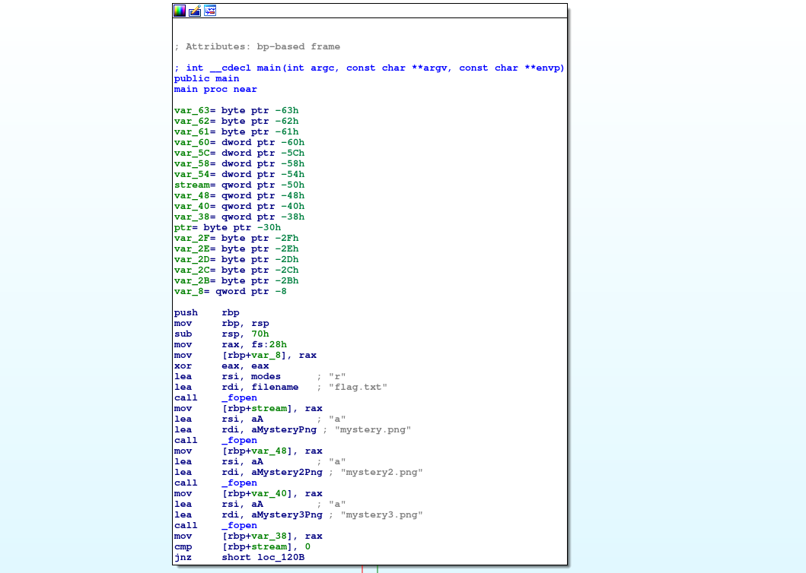
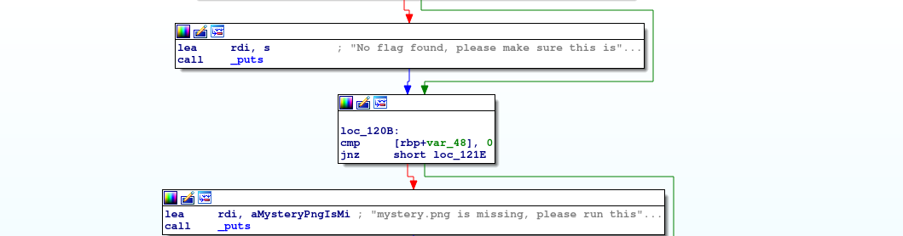
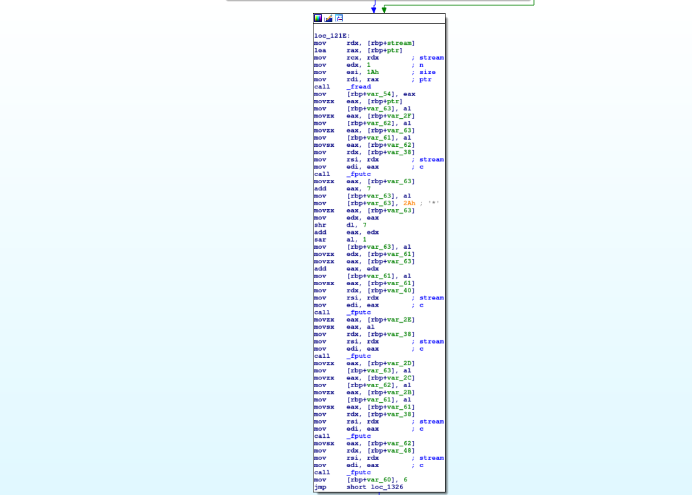
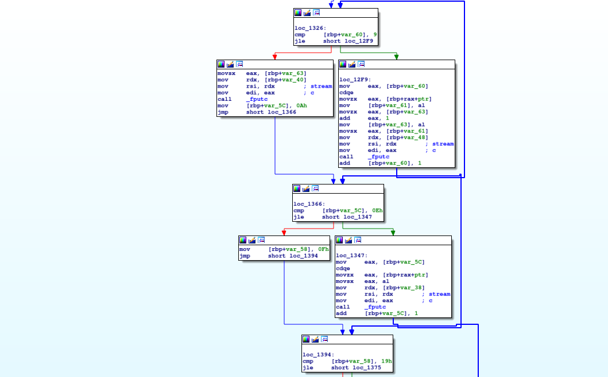
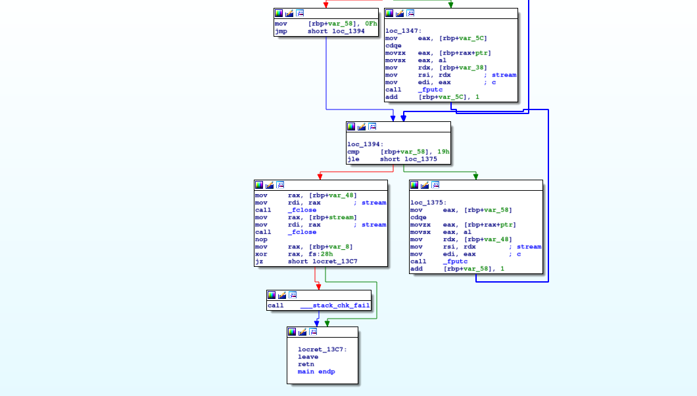

# Problem
We have recovered a [binary](https://2019shell1.picoctf.com/static/a92f44bedead13e12ac9bff5cbb87608/mystery) and a few images: [image](https://2019shell1.picoctf.com/static/a92f44bedead13e12ac9bff5cbb87608/mystery.png), [image2](https://2019shell1.picoctf.com/static/a92f44bedead13e12ac9bff5cbb87608/mystery2.png), [image3](https://2019shell1.picoctf.com/static/a92f44bedead13e12ac9bff5cbb87608/mystery3.png). See what you can make of it. There should be a flag somewhere. Its also found in /problems/investigative-reversing-1_1_a3bd3a15990df2554310c7c252e66385 on the shell server.

## Hints:

Try using some forensics skills on the image

This problem requires both forensics and reversing skills

A hex editor may be helpful

## Solution:

First, let's download the files:
```bash
wget https://2019shell1.picoctf.com/static/a92f44bedead13e12ac9bff5cbb87608/mystery
wget https://2019shell1.picoctf.com/static/a92f44bedead13e12ac9bff5cbb87608/mystery.png
wget https://2019shell1.picoctf.com/static/a92f44bedead13e12ac9bff5cbb87608/mystery2.png
wget https://2019shell1.picoctf.com/static/a92f44bedead13e12ac9bff5cbb87608/mystery3.png
```

We have some binary, and these images:


All look the same...

Trying disassemble the binary with IDA:







As we can see, the flag is encrypted and embbeded to three images (we can also see that using ```xxd```):
```bash
xxd mystery.png

...
0001e850: 8220 0882 2008 8220 6417 ffef fffd 7f5e  . .. .. d......^
0001e860: ed5a 9d38 d01f 5600 0000 0049 454e 44ae  .Z.8..V....IEND.
0001e870: 4260 8243 467b 416e 315f 3534 3530 3364  B`.CF{An1_54503d
0001e880: 387d f0                                  8}.

xxd mystery2.png

...
0001e840: 2008 8220 0882 2008 42f6 2123 1182 2008   .. .. .B.!#.. .
0001e850: 8220 0882 2008 8220 6417 ffef fffd 7f5e  . .. .. d......^
0001e860: ed5a 9d38 d01f 5600 0000 0049 454e 44ae  .Z.8..V....IEND.
0001e870: 4260 8285 73                             B`..s

xxd mystery3.png

...
0001e840: 2008 8220 0882 2008 42f6 2123 1182 2008   .. .. .B.!#.. .
0001e850: 8220 0882 2008 8220 6417 ffef fffd 7f5e  . .. .. d......^
0001e860: ed5a 9d38 d01f 5600 0000 0049 454e 44ae  .Z.8..V....IEND.
0001e870: 4260 8269 6354 3074 6861 5f              B`.icT0tha_
```

This time, we take another approach.
Let's generate a dummy flag, and look how it is written to the files.

```bash 
echo picoCTF{0123456789ABCDEF} > flag.txt

roee@Roee-Ubuntu:~/CTFs-Writeups/picoCTF-2019/Forensics/14-investigative_reversing_1-350/tmp$ ./mystery 
roee@Roee-Ubuntu:~/CTFs-Writeups/picoCTF-2019/Forensics/14-investigative_reversing_1-350/tmp$ xxd mystery.png 
00000000: 4346 7b30 3137 3839 4142 4344 4546 7d0a  CF{01789ABCDEF}.
roee@Roee-Ubuntu:~/CTFs-Writeups/picoCTF-2019/Forensics/14-investigative_reversing_1-350/tmp$ xxd mystery2.png 
00000000: 8573                                     .s
roee@Roee-Ubuntu:~/CTFs-Writeups/picoCTF-2019/Forensics/14-investigative_reversing_1-350/tmp$ xxd mystery3.png 
00000000: 6963 5432 3334 3536                      icT23456

rm mystery*png

echo picoCTF{abcdefghij012345} > flag.txt
roee@Roee-Ubuntu:~/CTFs-Writeups/picoCTF-2019/Forensics/14-investigative_reversing_1-350/tmp$ ./mystery 
roee@Roee-Ubuntu:~/CTFs-Writeups/picoCTF-2019/Forensics/14-investigative_reversing_1-350/tmp$ xxd mystery.png 
00000000: 4346 7b61 6268 696a 3031 3233 3435 7d0a  CF{abhij012345}.
roee@Roee-Ubuntu:~/CTFs-Writeups/picoCTF-2019/Forensics/14-investigative_reversing_1-350/tmp$ xxd mystery2.png 
00000000: 8573                                     .s
roee@Roee-Ubuntu:~/CTFs-Writeups/picoCTF-2019/Forensics/14-investigative_reversing_1-350/tmp$ xxd mystery3.png 
00000000: 6963 5463 6465 6667                      icTcdefg
```

We can see that the 9th and 10th bytes are copied to ```mystery.png```, after the `{`.
The next `5` bytes are copied to ```mystery3.png``` starting in the 4th position.
The last `9` bytes are copied to again to ```mystery.png``` in the position we stopped at.

Easy to revert!

Let's get the starting address:
```bash
grep --byte-offset --only-matching --text CF{ ./mystery.png

125043:CF{
```

Now, with a simple script:
```python
#!/usr/bin/env python

start_pos = 125043

f1 = open('./mystery.png', 'r').read()[start_pos:]
f2 = open('./mystery3.png', 'r').read()[start_pos:]

s = 'picoCTF{'

s += f1[3 : 4 + 1]
s += f2[3 :]
s += f1[5 : -1]

print s
```

Nice!

Flag: picoCTF{An0tha_1_54503d8}
