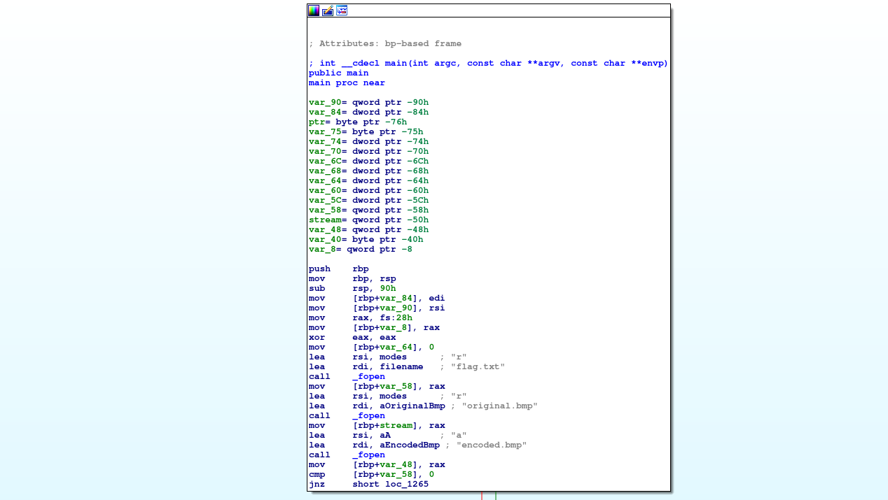
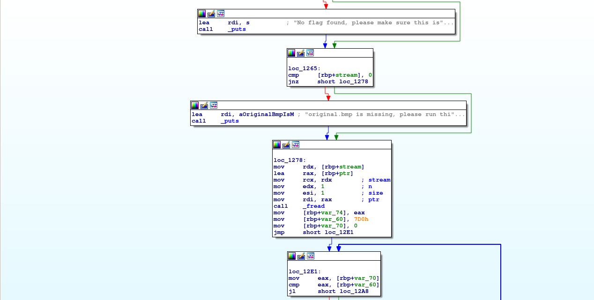
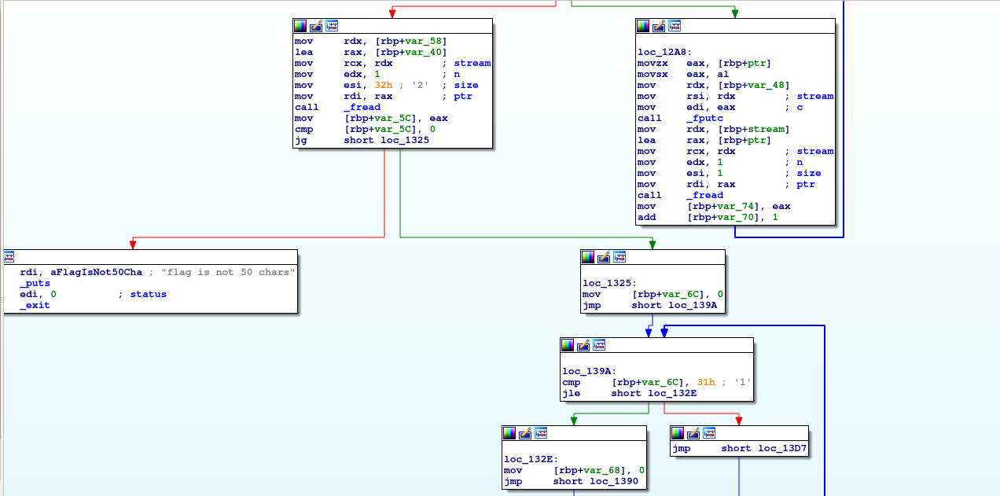
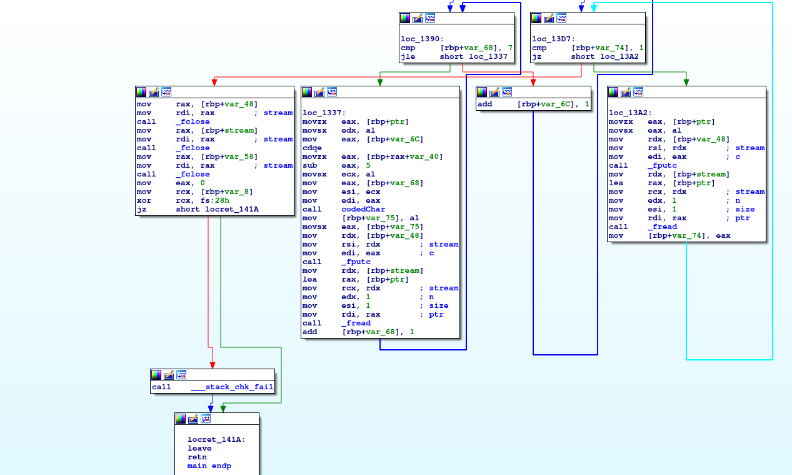

# Problem
We have recovered a [binary](https://2019shell1.picoctf.com/static/c32ea22ead4738ec130e717fa8f5249b/mystery) and an [image](https://2019shell1.picoctf.com/static/c32ea22ead4738ec130e717fa8f5249b/encoded.bmp) See what you can make of it. There should be a flag somewhere. Its also found in /problems/investigative-reversing-2_4_621640e66d2c0237e03186234a960aed on the shell server.

## Hints:

Try using some forensics skills on the image

This problem requires both forensics and reversing skills

What is LSB encoding?

## Solution:

First, let's download the files:
```bash
wget https://2019shell1.picoctf.com/static/c32ea22ead4738ec130e717fa8f5249b/mystery
wget https://2019shell1.picoctf.com/static/c32ea22ead4738ec130e717fa8f5249b/encoded.bmp
```

We have a binary, and this image:


Let's disassemble the binary with IDA:






In ```loc_1278```, ```loc_12E1``` and ```loc_12A8``` we just copy the first `0x7d0` bytes as is.
Then, we read `50` bytes from ```flag.txt``` into `var_40`.
Now, in ```loc_139A```, ```loc_132E```, ```loc_1390``` and ```loc_1337``` we encode each byte of the flag (after subtracting `5` from it) with ```codedChar```.
```codedChar``` gets a position (in ```edi```) a target char (in ```esi```) and a source char (in ```edx```) and set the LSB bit of ```edx``` accorting to the ```edi```'s bit of ```esi```.

Let's decrypt:
```python
#!/usr/bin/env python

f = open('./encoded.bmp', 'r').read()[0x7d0:]

s = ''

for i in range(50):
    c = 0

    for j in range(8):
        c |= (ord(f[i * 8 + j]) & 0x1) << j

    s += chr(c + 5)

print s
```

Nice!

Flag: picoCTF{n3xt_0n300000000000000000000000002133b312}
