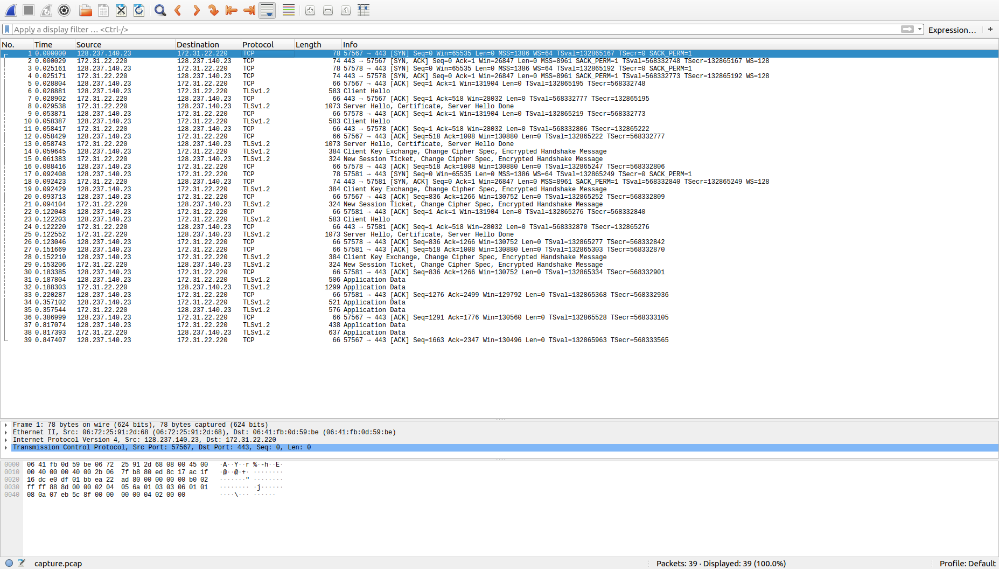
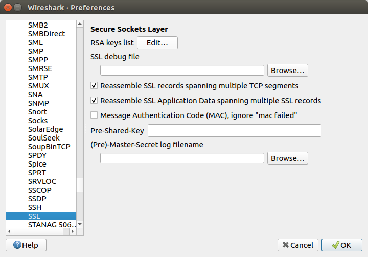
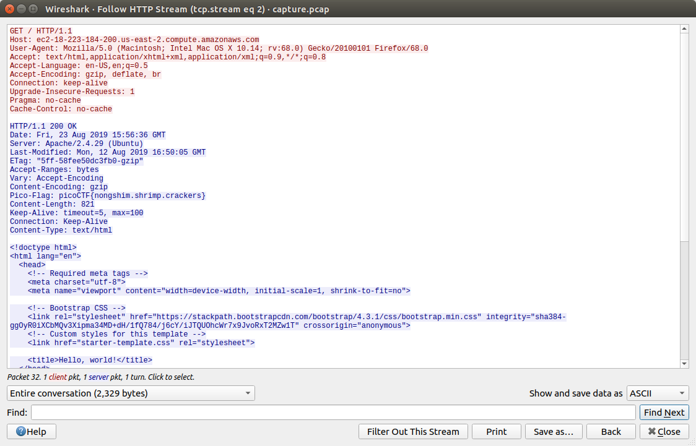

# Problem
We found this [packet capture](https://2019shell1.picoctf.com/static/470e17b168561f9eabdfa95e412dbe10/capture.pcap) and [key](https://2019shell1.picoctf.com/static/470e17b168561f9eabdfa95e412dbe10/picopico.key). Recover the flag. You can also find the file in /problems/webnet0_0_363c0e92cf19b68e5b5c14efb37ed786.

## Hints:

Try using a tool like Wireshark

How can you decrypt the TLS stream?

## Solution:

First, let's download the files:
```bash
wget https://2019shell1.picoctf.com/static/470e17b168561f9eabdfa95e412dbe10/capture.pcap
wget https://2019shell1.picoctf.com/static/470e17b168561f9eabdfa95e412dbe10/picopico.key
```

Opening the pcap file with wireshark shows us an encrypted communication:



Going to Edit &#8594; Preferences &#8594; Protocols &#8594; SSL and insert the key file ```picopico.key```.



Now the "Application Data" is decrypted.

looking at TCP stream 2 shows us the flag in a HTTP header:



Flag: picoCTF{nongshim.shrimp.crackers}
