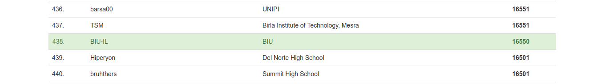

My score at the end of the competition:

ID      | Title                                                                                                 | Category         | Pts    | Flag
------- | ----------------------------------------------------------------------------------------------------- | ---------------- | ------ | ---
1       | [The Factory's Secret        ](./General/01-the_factorys_secret-1/solution.md)                        | General Skills   | 1      | ``
2       | [2Warm                       ](./General/02-2warm-50/solution.md)                                     | General Skills   | 50     | `picoCTF{101010}`
3       | [Glory of the Garden         ](./Forensics/01-glory_of_the_garden-50/solution.md)                     | Forensics        | 50     | `picoCTF{more_than_m33ts_the_3y31e0af5C7}`
4       | [Insp3ct0r                   ](./Web/01-insp3ct0r-50/solution.md)                                     | Web              | 50     | `picoCTF{tru3_d3t3ct1ve_0r_ju5t_lucky?9df7e69a}`
5       | [Lets Warm Up                ](./General/03-lets_warm_up-50/solution.md)                              | General Skills   | 50     | `picoCTF{p} `
6       | [The Numbers                 ](./Crypto/01-the_numbers-50/solution.md)                                | Cryptography     | 50     | `PICOCTF{THENUMBERSMASON}`
7       | [Warmed up                   ](./General/04-warmed_up-50/solution.md)                                 | General Skills   | 50     | `picoCTF{61}`
8       | [handy-shellcode             ](./Binary/01-handy_shellcode-50/solution.md)                            | Binary Exploit   | 50     | `picoCTF{h4ndY_d4ndY_sh311c0d3_707f1a87}`
9       | [practice-run-1              ](./Binary/02-practice_run_1-50/solution.md)                             | Binary Exploit   | 50     | `picoCTF{g3t_r3adY_2_r3v3r53}`
10      | [unzip                       ](./Forensics/02-unzip-50/solution.md)                                   | Forensics        | 50     | `picoCTF{unz1pp1ng_1s_3a5y}`
11      | [vault-door-training         ](./Reversing/01-vault-door-training-50/solution.md)                     | Reversing        | 50     | `picoCTF{w4rm1ng_Up_w1tH_jAv4_87f51143e4b}`
12      | [13                          ](./Crypto/02-13-100/solution.md)                                        | Cryptography     | 100    | `picoCTF{not_too_bad_of_a_problem}`
13      | [Bases                       ](./General/05-bases-100/solution.md)                                    | General Skills   | 100    | `picoCTF{l3arn_th3_r0p35}`
14      | [Easy1                       ](./Crypto/03-easy1-100/solution.md)                                     | Cryptography     | 100    | `picoCTF{CRYPTOISFUN}`
15      | [First Grep                  ](./General/06-first_grep-100/solution.md)                               | General Skills   | 100    | `picoCTF{grep_is_good_to_find_things_eda8911c}`
16      | [Overflow 0                  ](./Binary/03-overflow_0-100/solution.md)                                | Binary Exploit   | 100    | `picoCTF{3asY_P3a5y1fcf81f9}`
17      | [Resources                   ](./General/07-resources-100/solution.md)                                | General Skills   | 100    | `picoCTF{r3source_pag3_f1ag}`
18      | [caesar                      ](./Crypto/04-caesar-100/solution.md)                                    | Cryptography     | 100    | `picoCTF{crossingtherubicongysimakx}`
19      | [dont-use-client-side        ](./Web/02-dont_user_client_side-100/solution.md)                        | Web              | 100    | `picoCTF{no_clients_plz_4a60f3}`
20      | [logon                       ](./Web/03-logon-100/solution.md)                                        | Web              | 100    | `picoCTF{th3_c0nsp1r4cy_l1v3s_6f2c20e9}`
21      | [strings it                  ](./General/08-strings_it-100/solution.md)                               | General Skills   | 100    | `picoCTF{5tRIng5_1T_f1527258}`
22      | [valut-door-1                ](./Reversing/02-vault-door-1-100/solution.md)                           | Reversing        | 100    | `picoCTF{d35cr4mbl3_tH3_cH4r4cT3r5_9d038f}`
23      | [what's a net cat            ](./General/09-whats_a_net_cat-100/solution.md)                          | General Skills   | 100    | `picoCTF{nEtCat_Mast3ry_b1d25ece}`
24      | [where are the robots        ](./Web/04-where_are_the_robots-100/solution.md)                         | Web              | 100    | `picoCTF{ca1cu1at1ng_Mach1n3s_a44f7}`
25      | [Overflow 1                  ](./Binary/04-overflow_1-150/solution.md)                                | Binary Exploit   | 150    | `picoCTF{n0w_w3r3_ChaNg1ng_r3tURn5a32b9368}`
26      | [So Meta                     ](./Forensics/03-so_meta-150/solution.md)                                | Forensics        | 150    | `picoCTF{s0_m3ta_dc38ce45}`
27      | [What Lies Within            ](./Forensics/04-what_lies_within-150/solution.md)                       | Forensics        | 150    | `picoCTF{h1d1ng_1n_th3_b1t5}`
28      | [extensions                  ](./Forensics/05-extensions-150/solution.md)                             | Forensics        | 150    | `picoCTF{now_you_know_about_extensions}`
29      | [shark on wire 1             ](./Forensics/06-shark_on_wire-150/solution.md)                          | Forensics        | 150    | `picoCTF{StaT31355_636f6e6e}`
30      | [Based                       ](./General/10-based-200/solution.md)                                    | General Skills   | 200    | `picoCTF{learning_about_converting_values_b515dfd2}`
31      | [Client-side-again           ](./Web/05-client-side-again-200/solution.md)                            | Web              | 200    | `picoCTF{not_this_again_ea9191}`
32      | [First Grep: Part II         ](./General/11-first_grep_part_ii-200/solution.md)                       | General Skills   | 200    | `picoCTF{grep_r_to_find_this_0e28f3ee}`
33      | [Flags                       ](./Crypto/05-flags-200/solution.md)                                     | Cryptography     | 200    | `PICOCTF{F1AG5AND5TUFF}`
34      | [Mr-Worldwide                ](./Crypto/06-mr_worldwide-200/solution.md)                              | Cryptography     | 200    | `picoCTF{KODIAK_ALASKA}`
35      | [NewOverFLow-1               ](./Binary/05-newoverflow_1-200/solution.md)                             | Binary Exploit   | 200    | `picoCTF{th4t_w4snt_t00_d1ff3r3nt_r1ghT?_bfd48203}`
36      | [Open-to-admins              ](./Web/06-open_to_admins-200/solution.md)                               | Web              | 200    | `picoCTF{0p3n_t0_adm1n5_dcb566bb}`
37      | [Tapping                     ](./Crypto/07-tapping-200/solution.md)                                   | Cryptography     | 200    | `PICOCTF{M0RS3C0D31SFUN903140448}`
38      | [asm1                        ](./Reversing/03-asm1-200/solution.md)                                   | Reversing        | 200    | `0x533`
39      | [la cifta de                 ](./Crypto/08-la_cifra_de-200/solution.md)                               | Cryptography     | 200    | `picoCTF{b311a50_0r_v1gn3r3_c1ph3raac148e7}`
40      | [picobrowser                 ](./Web/07-picobrowser-200/solution.md)                                  | Web              | 200    | `picoCTF{p1c0_s3cr3t_ag3nt_ee951878}`
41      | [plumbing                    ](./General/12-plumbing-200/solution.md)                                 | General Skills   | 200    | `picoCTF{digital_plumb3r_8f946c69}`
42      | [rsa-pop-quiz                ](./Crypto/09-rsa_pop_quiz-200/solution.md)                              | Cryptography     | 200    | `picoCTF{wA8_th4t$_ill3aGal..o4d21b3ca}`
43      | [slippery-shellcode          ](./Binary/06-slippery-shellcode-200/solution.md)                        | Binary Exploit   | 200    | `picoCTF{sl1pp3ry_sh311c0d3_3d79d4df}`
44      | [vault-door-3                ](./Reversing/04-vault_door_3-200/solution.md)                           | Reversing        | 200    | `picoCTF{jU5t_a_s1mpl3_an4gr4m_4_u_90cf31}`
45      | [whats-the-difference        ](./General/13-whats_the_difference-200/solution.md)                     | General Skills   | 200    | `picoCTF{th3yr3_a5_d1ff3r3nt_4s_bu773r_4nd_j311y_aslkjfdsalkfslkflkjdsfdszmz10548}`
46      | [where-is-the-file           ](./General/14-where_is_the_file-200/solution.md)                        | General Skills   | 200    | `picoCTF{w3ll_that_d1dnt_w0RK_b2dab472}`
47      | [NewOverFLow-2               ](./Binary/07-newoverflow_2-250/solution.md)                             | Binary Exploit   | 250    | `picoCTF{r0p_1t_d0nT_st0p_1t_64362a2b}`
48      | [OverFlow 2                  ](./Binary/08-overflow_2-250/solution.md)                                | Binary Exploit   | 200    | `picoCTF{arg5_and_r3turn5e919413c}`
49      | [WhitePages                  ](./Forensics/07-white_pages-250/solution.md)                            | Forensics        | 250    | `picoCTF{not_all_spaces_are_created_equal_178d720252af1af29369e154eca23a95}`
50      | [asm2                        ](./Reversing/05-asm2-250/solution.md)                                   | Reversing        | 200    | `0xff`
51      | [corrupt                     ](./Forensics/08-c0rrupt-250/solution.md)                                | Forensics        | 250    | `picoCTF{c0rrupt10n_1847995}`
52      | [like1000                    ](./Forensics/09-like1000-250/solution.md)                               | Forensics        | 250    | `picoCTF{l0t5_0f_TAR5}`
53      | [m00nwalk                    ](./Forensics/10-m00nwalk-250/solution.md)                               | Forensics        | 250    | `picoCTF{beep_boop_im_in_space}`
54      | [vault-door-4                ](./Reversing/06-vault_door_4-250/solution.md)                           | Reversing        | 250    | `picoCTF{jU5t_4_bUnCh_0f_bYt3s_201b352d6c}`
55      | [CanaRy                      ](./Binary/09-canary-300/solution.md)                                    | Binary Exploit   | 300    | `picoCTF{cAnAr135_mU5t_b3_r4nd0m!_069c6f48}`
56      | [Investigative Reversing 0   ](./Forensics/Forensics/11-investigative_reversing_0-300/solution.md)    | Forensics        | 300    | `picoCTF{f0und_1t_57d0d47c}`
57      | [Irish-Name-Repo 1           ](./Web/08-irish_name_repo_1-300/solution.md)                            | Web              | 300    | `picoCTF{s0m3_SQL_96ab211c}`
58      | [asm3                        ](./Reversing/07-asm3-300/solution.md)                                   | Reversing        | 300    | `0xa72e`
59      | [flag_shop                   ](./General/15-flag_shop-300/solution.md)                                | General Skills   | 300    | `picoCTF{m0n3y_bag5_34c9a5f7}`
60      | [**leap-frog**                   ](./Binary/10-leap_frog-300/solution.md)                                 | Binary Exploit   | 300    | `picoCTF{h0p_r0p_t0p_y0uR_w4y_t0_v1ct0rY_ce26a829}`
61      | [m00nwalk2                   ](./Forensics/12-m00nwalk2-300/solution.md)                              | Forensics        | 300    | `picoCTF{the_answer_lies_hidden_in_plain_sight}`
63      | [miniRSA                     ](./Crypto/08-la_cifra_de-200/solution.md)                               | Cryptography     | 300    | `picoCTF{n33d_a_lArg3r_e_21d2334d}`
64      | [mus1c                       ](./General/16-mus1c-300/solution.md)                                    | General Skills   | 300    | `picoCTF{rrrocknrn0113r}`
65      | [**reverse_cipher**              ](./Reversing/08-reverse_cipher-300/solution.md)                         | Reversing        | 300    | `picoCTF{r3v3rs35f207e7a}`
67      | [stringzz                    ](./Binary/12-stringzz-300/solution.md)                                  | Binary Exploit   | 300    | `picoCTF{str1nG_CH3353_159c98a8}`
68      | [vault-door-5                ](./Reversing/09-vault_door_5-300/solution.md)                           | Reversing        | 300    | `frequency_is_c_over_lambda_drtmtnddlw`
69      | [waves over lambda           ](./Crypto/11-waves_over_lambda-300/solution.md)                         | Cryptography     | 300    | `picoCTF{n33d_a_lArg3r_e_21d2334d}`
70      | [1_wanna_b3_a_r0ck5tar       ](./General/17-1_wanna_b3_a_r0ck5tar-350/solution.md)                    | General Skills   | 350    | `picoCTF{BONJOVI}`
71      | [GoT                         ](./Binary/13-GoT-350/solution.md)                                       | Binary Exploit   | 350    | `picoCTF{A_s0ng_0f_1C3_and_f1r3_1ef72b2d}`
73      | [pointy                      ](./Binary/14-pointy-350/solution.md)                                    | Binary Exploit   | 350    | `picoCTF{g1v1ng_d1R3Ct10n5_cad9c1b8}`
74      | [**seed-sPRiNG**                 ](./Binary/15-seed_sPRiNG-350/solution.md)                               | Binary Exploit   | 350    | `picoCTF{pseudo_random_number_generator_not_so_random_829c50d19ba2bdb441975c0dabfcc1c0}`
75      | [vault-door-6                ](./Reversing/10-vault_door_6-350/solution.md)                           | Reversing        | 350    | `picoCTF{n0t_mUcH_h4rD3r_tH4n_x0r_aedeced}`
78      | [JaWT Scratchpad             ](./Web/11-JaWT_scratchpad-400/solution.md)                              | Web              | 400    | `picoCTF{jawt_was_just_what_you_thought_c84a0d3754338763548dfc2dc171cdd0}`
79      | [Java Script Kiddie          ](./Web/12-java_script_kiddie-400/solution.md)                           | Web              | 400    | `picoCTF{5184e4f12d91ca0e13de639627b4bb6a}`
81      | [asm4                        ](./Reversing/11-asm4-400/solution.md)                                   | Reversing        | 400    | `0x23c`
82      | [b00tl3gRSA2                 ](./Crypto/13-b00tl3gRSA2-400/solution.md)                               | Cryptography     | 400    | `picoCTF{bad_1d3a5_3468581}`
83      | [rop32                       ](./Binary/17-rop32-400/solution.md)                                     | Binary Exploit   | 400    | `picoCTF{rOp_t0_b1n_sH_dee2e288}`
84      | [rop64                       ](./Binary/18-rop64-400/solution.md)                                     | Binary Exploit   | 400    | `picoCTF{rOp_t0_b1n_sH_w1tH_n3w_g4dg3t5_d4b7a298}`
85      | [vault-door-7                ](./Reversing/12-vault_door_7-400/solution.md)                           | Reversing        | 400    | `picoCTF{A_b1t_0f_b1t_sh1fTiNg_97cb1f367b}`
86      | [**Java Script Kiddie 2**        ](./Web/13-java_script_kiddie_2-450/solution.md)                         | Web              | 450    | `picoCTF{f1ee7ff44419a675d1a0f0a1a91dff4c}`
87      | [b00tl3gRSA3                 ](./Crypto/14-b00tl3gRSA3-450/solution.md)                               | Cryptography     | 450    | `picoCTF{too_many_fact0rs_3978938}`
89      | [vault-door-8                ](./Reversing/13-vault_door_8-450/solution.md)                           | Reversing        | 400    | `picoCTF{s0m3_m0r3_b1t_sh1fTiNg_60bea5ea1}`
91      | [john_pollard                ](./Crypto/15-john_pollard-500/solution.md)                              | Cryptography     | 500    | `picoCTF{73176001,67867967}`
<!-- 62      | [messy-malloc                      ](./Binary/09-canary-300/solution.md)                        | Binary Exploit   | 300    | `` -->
<!-- 66      | [shark on wire 2                    ](./Forensics/09-like1000-250/solution.md)                   | Forensics        | 250    | `picoCTF{l0t5_0f_TAR5}` -->
<!-- 72      | [Irish-Name-Repo 2           ](./Web/09-irish_name_repo_2-350/solution.md)                            | Web              | 350    | `` -->
<!-- 76      | [AES-ABC                     ](./CCrypto/12-AES_ABC-400/solution.md)                                  | Cryptography     | 400    | `` -->
<!-- 77      | [Empire1                     ](./Web/10-empire_1-400/solution.md)                                     | Web              | 400    | `` -->
<!-- 80      | [L1im1lT355                  ](./Binary/16-L1im1tL355-400/solution.md)                                | Binary Exploit   | 400    | `` -->
<!-- 88      | [cereal hacker 1             ](./Web/14-cereal_hacker_1-450/solution.md)                              | Web              | 450    | `` -->
<!-- 90      | [Ghost_Diary                 ](./Binary/19-ghost_diary-500/solution.md)                               | Binary Exploit   | 500    | `` -->

**In bold the challenges I solved only after competition ended**