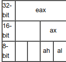

# Problem
What does asm3(0xd46c9935,0xdfe28722,0xb335450f) return? Submit the flag as a hexadecimal value (starting with '0x'). NOTE: Your submission for this question will NOT be in the normal flag format. [Source](https://2019shell1.picoctf.com/static/7fa30288613be44a6a39c1191ccf1971/test.S) located in the directory at /problems/asm3_2_376e88472c6a9317470a12cc31d506a4.

## Hints:

more(?) [registers](https://wiki.skullsecurity.org/index.php?title=Registers)

## Solution:

First download the source and look at it:
```bash
wget https://2019shell1.picoctf.com/static/7fa30288613be44a6a39c1191ccf1971/test.S
cat test.S
```

```asm
asm3:
    <+0>:   push   ebp
    <+1>:   mov    ebp,esp
    <+3>:   xor    eax,eax
    <+5>:   mov    ah,BYTE PTR [ebp+0xa]
    <+8>:   shl    ax,0x10
    <+12>:  sub    al,BYTE PTR [ebp+0xf]
    <+15>:  add    ah,BYTE PTR [ebp+0xe]
    <+18>:  xor    ax,WORD PTR [ebp+0x10]
    <+22>:  nop
    <+23>:  pop    ebp
    <+24>:  ret
```

Let's take a look at the structure of the ```eax``` register:


The function gets 3 parameters: [ebp+0x8, ebp+0xc, ebp+0x10].
Lets try to reverse it:

```c
asm1(int v1, int v2, int v3) {
    // xor    eax,eax 
    int a = 0;

    // mov    ah,BYTE PTR [ebp+0xa] 
    a &= 0xFFFF00FF;
    a |= (((v1 & 0x00FF0000) >> 16) << 8); 

    // effectively the outcome of - shl    ax,0x10
    a &= 0xFFFF0000;

    // sub  al,BYTE PTR [ebp+0xf]
    a = a & 0xFFFFFF00 | (a & 0x000000FF - ((v2 & 0xFF000000) >> 24));

    // add  ah,BYTE PTR [ebp+0xe]
    a = a & 0xFFFF00FF | (((a & 0xFFFF00FF) >> 8) + ((v2 & 0x00FF0000) >> 16)) << 8;

    // xor  ax,WORD PTR [ebp+0x12]
    a ^= (v3 & 0x0000FFFF);

    return a;
}
```

Lets "debug" asm3(0xd46c9935,0xdfe28722,0xb335450f):

```c
asm3(0xd46c9935,0xdfe28722,0xb335450f) {
    // xor    eax,eax 
    int a = 0;

    // mov    ah,BYTE PTR [ebp+0xa] 
    a &= 0xFFFF00FF;

    // a now equals 0x0

    a |= (((0xd46c9935 & 0x00FF0000) >> 16) << 8); 

    // a now equals 0x00004600

    // effectively the outcome of - shl    ax,0x10
    a &= 0xFFFF0000;

    // a now equals 0x0 again

    // sub  al,BYTE PTR [ebp+0xf]
    a = a & 0xFFFFFF00 | (a & 0x000000FF - ((0xdfe28722 & 0xFF000000) >> 24));

    // a now is 0x21

    // add  ah,BYTE PTR [ebp+0xe]
    a = a & 0xFFFF00FF | (((a & 0xFFFF00FF) >> 8) + ((0xdfe28722 & 0x00FF0000) >> 16)) << 8;

    // a now is 0xe221

    // xor  ax,WORD PTR [ebp+0x12]
    a ^= (0xb335450f & 0x0000FFFF);

    // a gets 1110001000100001 ^ 
    //        0100010100001111 = 
    //        1010011100101110 = 0xa72e
    return a;
}
```

Flag: 0xa72e
