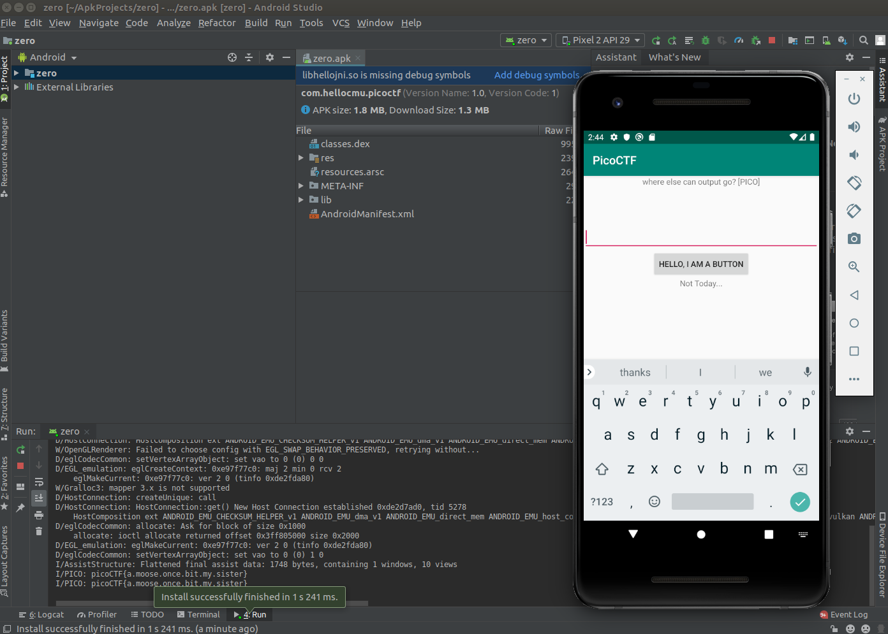

# Problem
Where do droid logs go. Check out this file. You can also find the [file](https://2019shell1.picoctf.com/static/fab5805be31eb4c802d0fdc711a1898d/zero.apk) in /problems/droids0_0_205f7b4a3b23490adffddfcfc45a2ca3.

## Hints:

Try using an emulator or device

https://developer.android.com/studio

## Solution:

First download the source and look at it:
```bash
wget https://2019shell1.picoctf.com/static/fab5805be31eb4c802d0fdc711a1898d/zero.apk
```

Following the hint, we install [android studio](https://developer.android.com/studio), and execute the apk using the emulator.



The app says:
> where else can the output go? [PICO]

Well, we can see the flag in the console.

Flag: picoCTF{a.moose.once.bit.my.sister}
