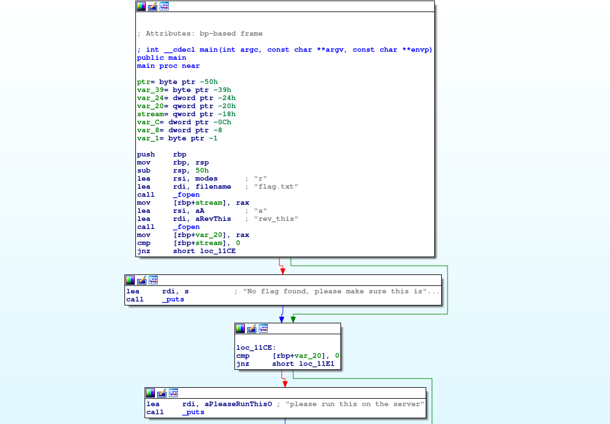

# Problem
We have recovered a [binary](https://2019shell1.picoctf.com/static/c07ee79952896e367a7ae8db38c2c657/rev) and a [text file](https://2019shell1.picoctf.com/static/c07ee79952896e367a7ae8db38c2c657/rev_this). Can you reverse the flag. Its also found in /problems/reverse-cipher_2_d8dc36eefa9dfce00eac3dab8f42513c on the shell server.

## Hints:

more(?) [registers](https://wiki.skullsecurity.org/index.php?title=Registers)

## Solution:

First download the files:
```bash
wget https://2019shell1.picoctf.com/static/c07ee79952896e367a7ae8db38c2c657/rev
wget https://2019shell1.picoctf.com/static/c07ee79952896e367a7ae8db38c2c657/rev_this
```

Let's take a loot:
```bash
cat rev_this

picoCTF{w1{1wq83k055j5f}picoCTF{ycxrddq_l]]V]V]XpicoCTF{ycxrddq_l]]V]V]XpicoCTF{ycxrddq_l]]V]V]XpicoCTF{ycxrddq_l]]V]V]XpicoCTF{ycxrddq_l]]V]V]XpicoCTF{ycxrddq_l]]V]V]XpicoCTF{ycxrddq_l]]V]V]XpicoCTF{ycxrddq_l]]V]V]X
```

Let's disassemble the binary with IDA:




In ```loc_11E1``` we just reading `0x18 = 24` bytes from ```flag.txt``` to ```ptr```.
In ```loc_1211```, ```loc_123D``` and ```loc_121A``` we copy the first `8` bytes to ```rev_this```.
Now, in ```loc_128F``` and ```loc_124C``` and the lower three blocks we copy the next `15` bytes as following:
* Odd bytes are subtracted by `2`.
* Even bytes are added to `5`.

The 24th byte is copied as is.

Let's write a simple script:
```python
#!/usr/bin/env python

f = open('./rev_this', 'r').read()

s = f[:8]

for i in range(8, 8 + 16):
    if i % 2 == 1:
        s += chr(ord(f[i]) + 2)    
    else:
        s += chr(ord(f[i]) - 5)    
    
s += f[23]

print s
```

Flag: picoCTF{r3v3rs35f207e7a}
