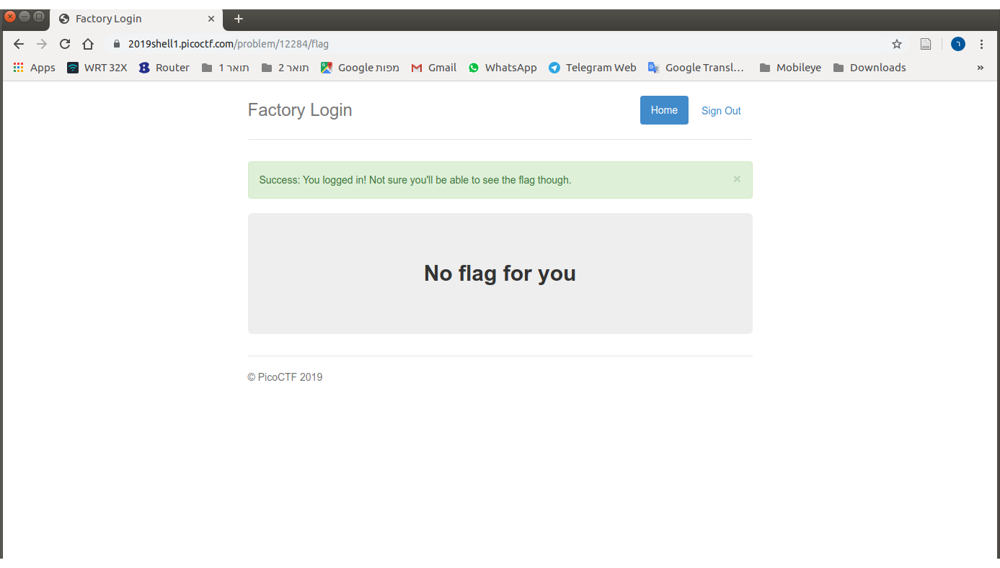
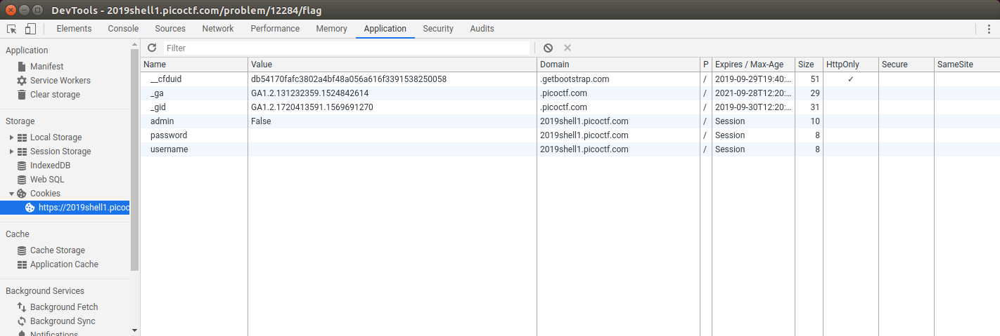
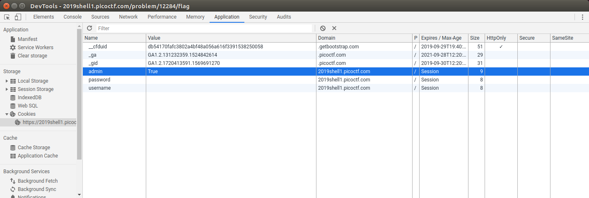
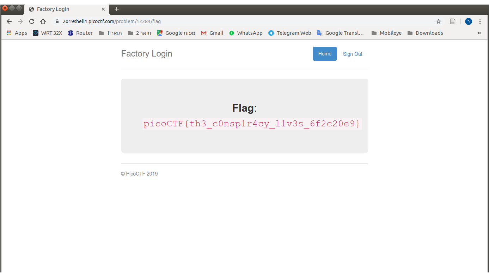

# Problem
The factory is hiding things from all of its users. Can you login as logon and find what they've been looking at? [https://2019shell1.picoctf.com/problem/12284/](https://2019shell1.picoctf.com/problem/12284/) or http://2019shell1.picoctf.com:12284

## Hints:
Hmm it doesn't seem to check anyone's password, except for {{name}}'s?

## Solution:

Open the site and try to search for information.

First we look at the source of the page
```bash
curl https://2019shell1.picoctf.com/problem/12284/

<!DOCTYPE html>
<html lang="en">

<head>
    <title>Factory Login</title>


    <link href="https://maxcdn.bootstrapcdn.com/bootstrap/3.2.0/css/bootstrap.min.css" rel="stylesheet">

    <link href="https://getbootstrap.com/docs/3.3/examples/jumbotron-narrow/jumbotron-narrow.css" rel="stylesheet">

    <script src="https://ajax.googleapis.com/ajax/libs/jquery/3.3.1/jquery.min.js"></script>

    <script src="https://maxcdn.bootstrapcdn.com/bootstrap/3.3.7/js/bootstrap.min.js"></script>


</head>

<body>

    <div class="container">
        <div class="header">
            <nav>
                <ul class="nav nav-pills pull-right">
                    <li role="presentation" class="active"><a href="/">Home</a>
                    </li>
                    <li role="presentation"><a href="/logout" class="btn btn-link pull-right">Sign Out</a>
                    </li>
                </ul>
            </nav>
            <h3 class="text-muted">Factory Login</h3>
        </div>
        
        <!-- Categories: success (green), info (blue), warning (yellow), danger (red) -->
        
      
      <div class="jumbotron">
        <p class="lead"></p>
        <div class="login-form">
            <form role="form" action="/login" method="post">
                <div class="form-group">
                    <input type="text" name="user" id="email" class="form-control input-lg" placeholder="Username">
                </div>
                <div class="form-group">
                    <input type="password" name="password" id="password" class="form-control input-lg" placeholder="Password">
                </div>
            </div>
            <div class="row">
                <div class="col-xs-12 col-sm-12 col-md-12">
                    <input type="submit" class="btn btn-lg btn-success btn-block" value="Sign In">
                </div>
            </div>
        </form>
    </div>
    <footer class="footer">
        <p>&copy; PicoCTF 2019</p>
    </footer>

</div>

<script>
$(document).ready(function(){
    $(".close").click(function(){
        $("myAlert").alert("close");
    });
});
</script>
</body>

</html>
```

Let's try to login with empty credentials:


Let's take a look at the cookies:


We just need to update the ```admin``` cookie:


And we got the flag:


Flag: picoCTF{th3_c0nsp1r4cy_l1v3s_6f2c20e9}