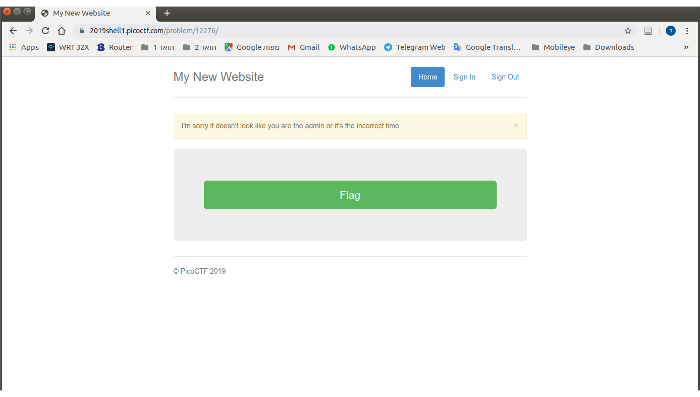
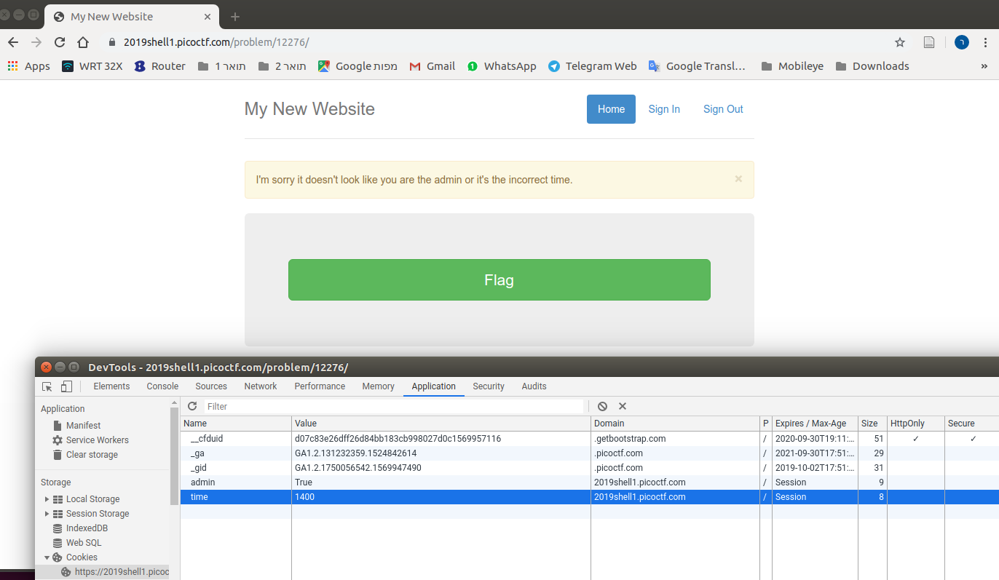
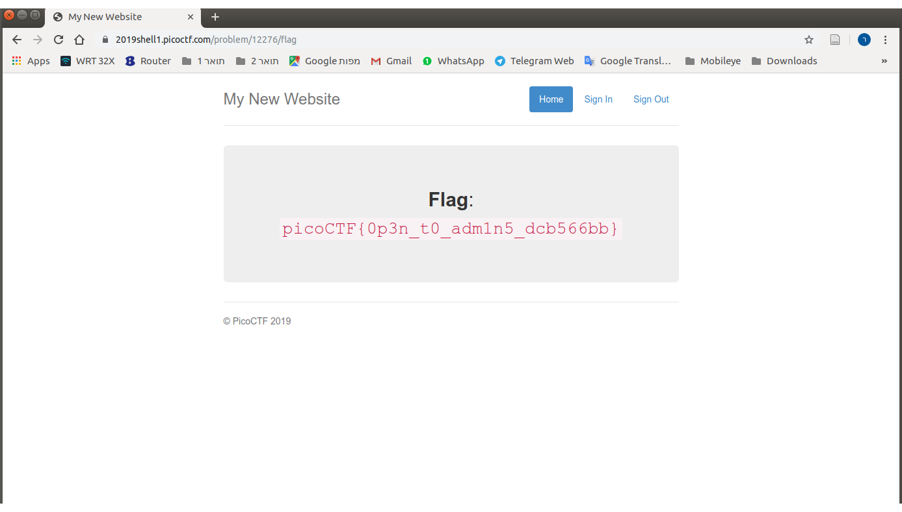

# Problem
This secure website allows users to access the flag only if they are admin and if the time is exactly 1400. [https://2019shell1.picoctf.com/problem/12276/](https://2019shell1.picoctf.com/problem/12276/) or http://2019shell1.picoctf.com:12276

## Hints:
Can cookies help you to get the flag?

## Solution:

Lets go to the site:

Let's set the two cookies:

And we got it:

Flag: picoCTF{0p3n_t0_adm1n5_dcb566bb}
