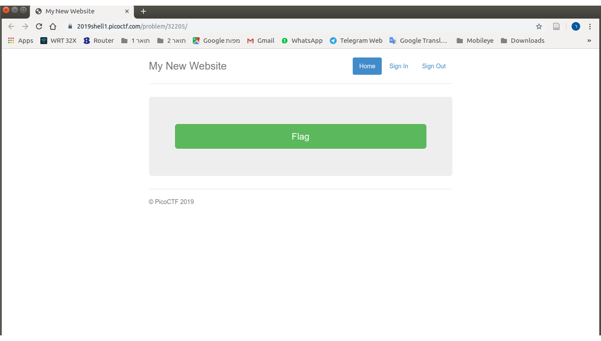
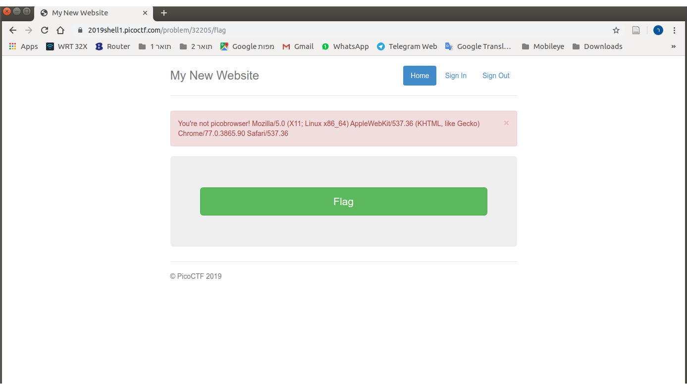

# Problem
This website can be rendered only by picobrowser, go and catch the flag! [https://2019shell1.picoctf.com/problem/32205/](https://2019shell1.picoctf.com/problem/32205/) or http://2019shell1.picoctf.com:32205

## Hints:
You dont need to download a new web browser

## Solution:

We first try to observe the site:


Try to get the flag:


Let's spoof the [user agent](https://en.wikipedia.org/wiki/User_agent):
```bash
curl -A "picobrowser" https://2019shell1.picoctf.com/problem/32205/flag

<!DOCTYPE html>
<html lang="en">

<head>
    <title>My New Website</title>


    <link href="https://maxcdn.bootstrapcdn.com/bootstrap/3.2.0/css/bootstrap.min.css" rel="stylesheet">

    <link href="https://getbootstrap.com/docs/3.3/examples/jumbotron-narrow/jumbotron-narrow.css" rel="stylesheet">

    <script src="https://ajax.googleapis.com/ajax/libs/jquery/3.3.1/jquery.min.js"></script>

    <script src="https://maxcdn.bootstrapcdn.com/bootstrap/3.3.7/js/bootstrap.min.js"></script>

</head>

<body>

    <div class="container">
        <div class="header">
            <nav>
                <ul class="nav nav-pills pull-right">
                    <li role="presentation" class="active"><a href="/">Home</a>
                    </li>
                    <li role="presentation"><a href="/unimplemented">Sign In</a>
                    </li>
                    <li role="presentation"><a href="/unimplemented">Sign Out</a>
                    </li>
                </ul>
            </nav>
            <h3 class="text-muted">My New Website</h3>
        </div>
        
       <!-- Categories: success (green), info (blue), warning (yellow), danger (red) -->
       
       
       <div class="alert alert-success alert-dismissible" role="alert" id="myAlert">
         <button type="button" class="close" data-dismiss="alert" aria-label="Close"><span aria-hidden="true">&times;</span></button>
         <!-- <strong>Title</strong> --> picobrowser!
           </div>
     
     
     
        <div class="jumbotron">
            <p class="lead"></p>
            <p style="text-align:center; font-size:30px;"><b>Flag</b>: <code>picoCTF{p1c0_s3cr3t_ag3nt_ee951878}</code></p>
            <!-- <p><a class="btn btn-lg btn-success" href="admin" role="button">Click here for the flag!</a> -->
            <!-- </p> -->
        </div>


        <footer class="footer">
            <p>&copy; PicoCTF 2019</p>
        </footer>

    </div>
    <script>
    $(document).ready(function(){
        $(".close").click(function(){
            $("myAlert").alert("close");
        });
    });
    </script>
</body>

</html>
```

Got it!

Flag: picoCTF{p1c0_s3cr3t_ag3nt_ee951878}
