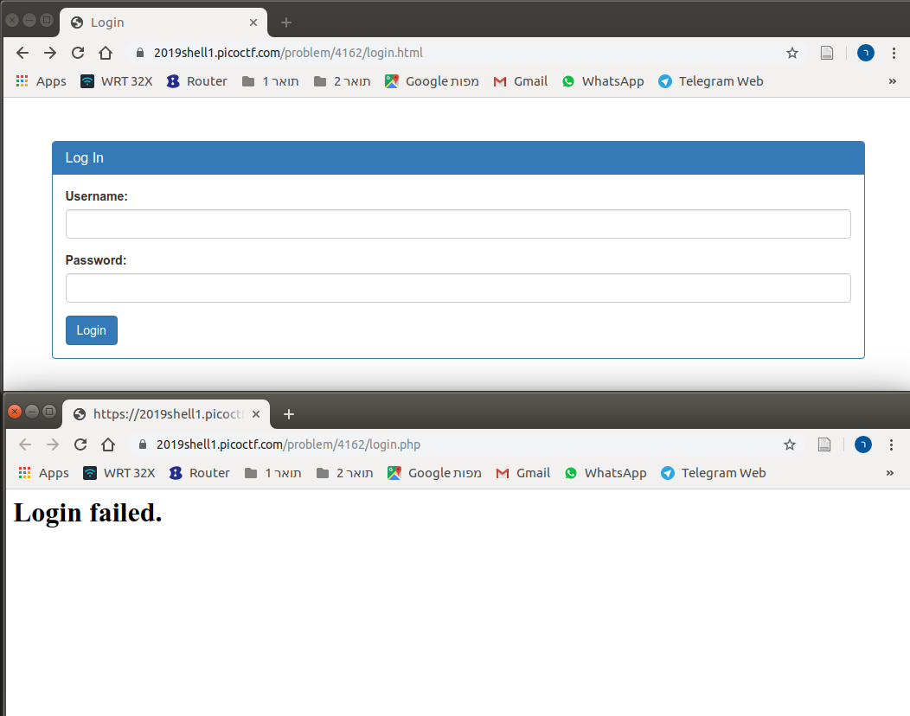
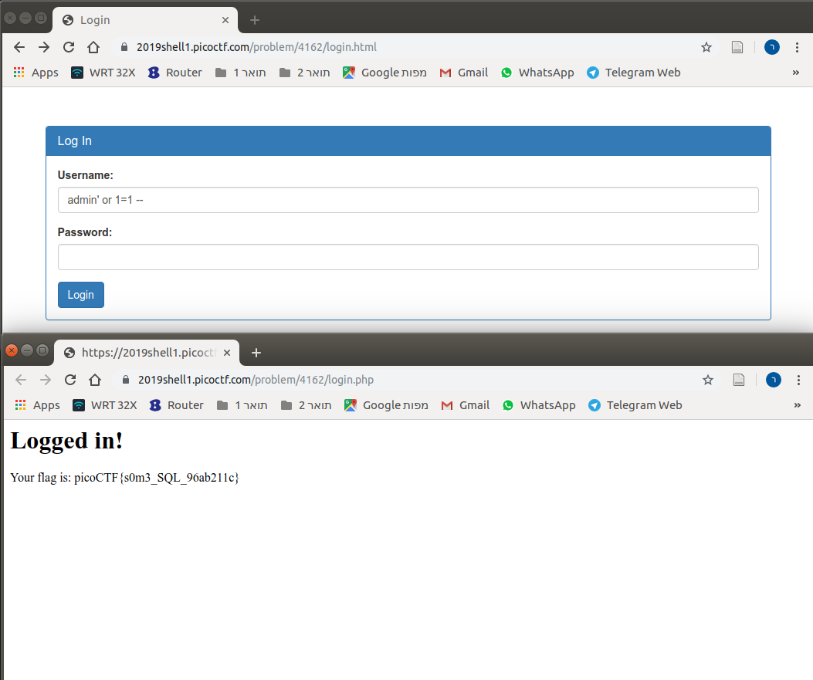

# Problem
There is a website running at https://2019shell1.picoctf.com/problem/4162/ [link](https://2019shell1.picoctf.com/problem/4162/) or http://2019shell1.picoctf.com:4162. Do you think you can log us in? Try to see if you can login!

## Hints:

There doesn't seem to be many ways to interact with this, I wonder if the users are kept in a database?

Try to think about how does the website verify your login?

## Solution:

We first try to observe the site:

We need to login:

Let's try a simple [SQL Injection](https://en.wikipedia.org/wiki/SQL_injection):

Got it!

Flag: picoCTF{s0m3_SQL_96ab211c}
