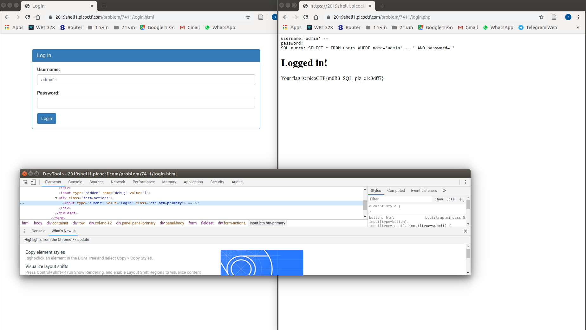

# Problem
There is a website running at https://2019shell1.picoctf.com/problem/7411/ ([link](https://2019shell1.picoctf.com/problem/7411/)). Someone has bypassed the login before, and now it's being strengthened. Try to see if you can still login! or http://2019shell1.picoctf.com:7411

## Hints:

The password is being filtered.

## Solution:

We first try to observe the site:

We need to login, let's set the `debug` field (using DevTools) and try a simple query:

Let's try a simple [SQL Injection](https://en.wikipedia.org/wiki/SQL_injection):

Got it!

Flag: picoCTF{m0R3_SQL_plz_c1c3dff7}
