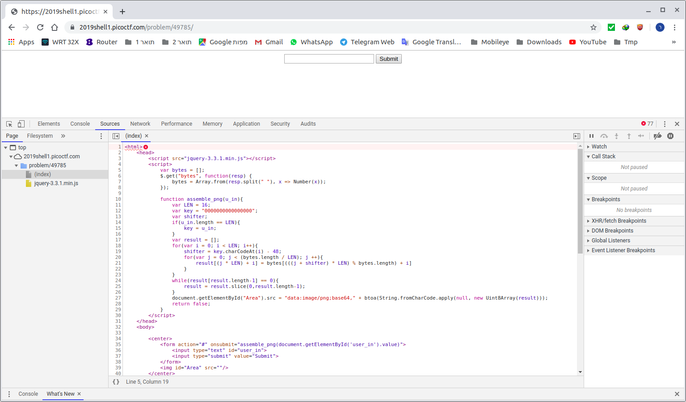
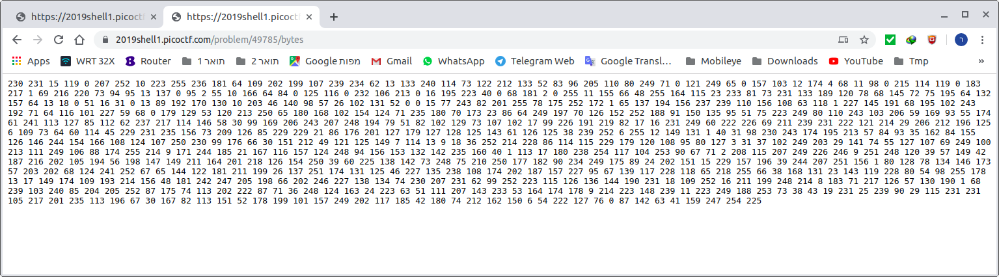

# Problem
The image link appears broken... https://2019shell1.picoctf.com/problem/49785 or http://2019shell1.picoctf.com:49785

## Hints:

This is only a JavaScript problem.

## Solution:

Lets go to the site:


We have this script:
```javascript
<script>
    var bytes = [];
    $.get("bytes", function(resp) {
        bytes = Array.from(resp.split(" "), x => Number(x));
    });

    function assemble_png(u_in){
        var LEN = 16;
        var key = "0000000000000000";
        var shifter;
        if(u_in.length == LEN){
            key = u_in;
        }
        var result = [];
        for(var i = 0; i < LEN; i++){
            shifter = key.charCodeAt(i) - 48;
            for(var j = 0; j < (bytes.length / LEN); j ++){
                result[(j * LEN) + i] = bytes[(((j + shifter) * LEN) % bytes.length) + i]
            }
        }
        while(result[result.length-1] == 0){
            result = result.slice(0,result.length-1);
        }
        document.getElementById("Area").src = "data:image/png;base64," + btoa(String.fromCharCode.apply(null, new Uint8Array(result)));
        return false;
    }
</script>
```

Let's get the [bytes](https://2019shell1.picoctf.com/problem/49785/bytes):


```bash
230 231 15 119 0 207 252 10 223 255 236 181 64 109 202 199 107 239 234 62 13 133 240 114 73 122 212 133 52 83 96 205 110 80 249 71 0 121 249 65 0 157 103 12 174 4 68 11 98 0 215 114 119 0 183 217 1 69 216 220 73 94 95 13 137 0 95 2 55 10 166 64 84 0 125 116 0 232 106 213 0 16 195 223 40 0 68 181 2 0 255 11 155 66 48 255 164 115 23 233 81 73 231 133 189 120 78 68 145 72 75 195 64 132 157 64 13 18 0 51 16 31 0 13 89 192 170 130 10 203 46 140 98 57 26 102 131 52 0 0 15 77 243 82 201 255 78 175 252 172 1 65 137 194 156 237 239 110 156 108 63 118 1 227 145 191 68 195 102 243 192 71 64 116 101 227 59 68 0 179 129 53 120 213 250 65 180 168 102 154 124 71 235 180 70 173 23 86 64 249 197 70 126 152 252 188 91 150 135 95 51 75 223 249 80 110 243 103 206 59 169 93 55 174 61 241 113 127 85 112 62 237 217 114 146 58 30 99 169 206 243 207 248 194 79 51 82 102 129 73 107 102 17 99 226 191 219 82 17 16 231 249 60 222 226 69 211 239 231 222 121 214 29 206 212 196 125 6 109 73 64 60 114 45 229 231 235 156 73 209 126 85 229 229 21 86 176 201 127 179 127 128 125 143 61 126 125 38 239 252 6 255 12 149 131 1 40 31 98 230 243 174 195 213 57 84 93 35 162 84 155 126 146 244 154 166 108 124 107 250 230 99 176 66 30 151 212 49 121 125 149 7 114 13 9 18 36 252 214 228 86 114 115 229 179 120 108 95 80 127 3 31 37 102 249 203 29 141 74 55 127 107 69 249 100 213 111 249 106 88 174 255 214 9 171 244 185 21 167 116 157 124 248 94 156 153 132 142 235 160 40 1 113 17 180 238 254 117 104 253 90 67 71 2 208 115 207 249 226 246 9 251 248 120 39 57 149 42 187 216 202 105 194 56 198 147 149 211 164 201 218 126 154 250 39 60 225 138 142 73 248 75 210 250 177 182 90 234 249 175 89 24 202 151 15 229 157 196 39 244 207 251 156 1 80 128 78 134 146 173 57 203 202 68 124 241 252 67 65 144 122 181 211 199 26 137 251 174 131 125 46 227 135 238 108 174 202 187 157 227 95 67 139 117 228 118 65 218 255 66 38 168 131 23 143 119 228 80 54 98 255 178 13 17 149 174 109 193 214 156 48 181 242 247 205 198 66 202 246 227 138 134 74 230 207 231 62 99 252 223 115 126 136 144 190 231 18 109 252 16 211 199 248 214 8 183 71 217 126 57 130 190 1 68 239 103 240 85 204 205 252 87 175 74 113 202 222 87 71 36 248 124 163 24 223 63 51 111 207 143 233 53 164 174 178 9 214 223 148 239 11 223 249 188 253 73 38 43 19 231 25 239 90 29 115 231 231 105 217 201 235 113 196 67 30 167 82 113 151 52 178 199 101 157 249 202 117 185 42 180 74 212 162 150 6 54 222 127 76 0 87 142 63 41 159 247 254 225
```

The script gets a 16 bytes key, and deobfuscates ```bytes``` accordingly to get a png file.

Let's try a script:
```python
#!/usr/bin/env python3
import itertools
from PIL import Image
import io
from pyzbar.pyzbar import decode


b = list(map(int, '230 231 15 119 0 207 252 10 223 255 236 181 64 109 202 199 107 239 234 62 13 133 240 114 73 122 212 133 52 83 96 205 110 80 249 71 0 121 249 65 0 157 103 12 174 4 68 11 98 0 215 114 119 0 183 217 1 69 216 220 73 94 95 13 137 0 95 2 55 10 166 64 84 0 125 116 0 232 106 213 0 16 195 223 40 0 68 181 2 0 255 11 155 66 48 255 164 115 23 233 81 73 231 133 189 120 78 68 145 72 75 195 64 132 157 64 13 18 0 51 16 31 0 13 89 192 170 130 10 203 46 140 98 57 26 102 131 52 0 0 15 77 243 82 201 255 78 175 252 172 1 65 137 194 156 237 239 110 156 108 63 118 1 227 145 191 68 195 102 243 192 71 64 116 101 227 59 68 0 179 129 53 120 213 250 65 180 168 102 154 124 71 235 180 70 173 23 86 64 249 197 70 126 152 252 188 91 150 135 95 51 75 223 249 80 110 243 103 206 59 169 93 55 174 61 241 113 127 85 112 62 237 217 114 146 58 30 99 169 206 243 207 248 194 79 51 82 102 129 73 107 102 17 99 226 191 219 82 17 16 231 249 60 222 226 69 211 239 231 222 121 214 29 206 212 196 125 6 109 73 64 60 114 45 229 231 235 156 73 209 126 85 229 229 21 86 176 201 127 179 127 128 125 143 61 126 125 38 239 252 6 255 12 149 131 1 40 31 98 230 243 174 195 213 57 84 93 35 162 84 155 126 146 244 154 166 108 124 107 250 230 99 176 66 30 151 212 49 121 125 149 7 114 13 9 18 36 252 214 228 86 114 115 229 179 120 108 95 80 127 3 31 37 102 249 203 29 141 74 55 127 107 69 249 100 213 111 249 106 88 174 255 214 9 171 244 185 21 167 116 157 124 248 94 156 153 132 142 235 160 40 1 113 17 180 238 254 117 104 253 90 67 71 2 208 115 207 249 226 246 9 251 248 120 39 57 149 42 187 216 202 105 194 56 198 147 149 211 164 201 218 126 154 250 39 60 225 138 142 73 248 75 210 250 177 182 90 234 249 175 89 24 202 151 15 229 157 196 39 244 207 251 156 1 80 128 78 134 146 173 57 203 202 68 124 241 252 67 65 144 122 181 211 199 26 137 251 174 131 125 46 227 135 238 108 174 202 187 157 227 95 67 139 117 228 118 65 218 255 66 38 168 131 23 143 119 228 80 54 98 255 178 13 17 149 174 109 193 214 156 48 181 242 247 205 198 66 202 246 227 138 134 74 230 207 231 62 99 252 223 115 126 136 144 190 231 18 109 252 16 211 199 248 214 8 183 71 217 126 57 130 190 1 68 239 103 240 85 204 205 252 87 175 74 113 202 222 87 71 36 248 124 163 24 223 63 51 111 207 143 233 53 164 174 178 9 214 223 148 239 11 223 249 188 253 73 38 43 19 231 25 239 90 29 115 231 231 105 217 201 235 113 196 67 30 167 82 113 151 52 178 199 101 157 249 202 117 185 42 180 74 212 162 150 6 54 222 127 76 0 87 142 63 41 159 247 254 225'.split(' ')))
png_header = '89504e470d0a1a0a0000000d49484452'
png_header = [png_header[i*2:(i+1)*2] for i in range(len(png_header) // 2)]
png_header = list(map(lambda x: int(x, 16), png_header))

LEN = 16
key = [None for _ in range(LEN)]

shifters = []

for i in range(LEN):
    shifters_i = []
    for shifter in range(10):
        if b[(shifter * LEN) % len(b) + i] == png_header[i]:
            shifters_i.append(shifter)

    shifters.append(shifters_i)

def assemble_png(k):
    result = [0 for _ in range(30000)]

    for i in range(LEN):
        shifter = ord(k[i]) - ord('0')
        for j in range(len(b) // LEN):
            result[(j * LEN) + i] = b[(((j + shifter) * LEN) % len(b)) + i]

    i = len(result) - 1
    while result[i] == 0:
        i -= 1

    result = result[:i + 1]

    return result

valid_keys = []
print('{:<5}{:<20}{}'.format('#', 'Candidate', 'isValid?'))
for i, key_candidate in enumerate(itertools.product(*shifters)):
    key_candidate = ''.join(map(str, key_candidate))

    png_candidate = assemble_png(key_candidate)
    f = io.BytesIO(bytes(png_candidate))

    valid = False
    try:
        pilimage = Image.open(f)
        valid = True
        valid_keys.append(key_candidate)
    except:
        pass

    print('{:<5}{:<20}{}'.format(i, key_candidate, valid))

print
for key in valid_keys:
    f = io.BytesIO(bytes(assemble_png(key)))
    pilimage = Image.open(f)
    decoded = decode(pilimage)[0]

    if 'picoCTF' in str(decoded.data):
        print(str(decoded.data, 'utf-8'))
```
We know that is the correct header of png, so we can try to decode a correct key:

Flag: picoCTF{5184e4f12d91ca0e13de639627b4bb6a}
